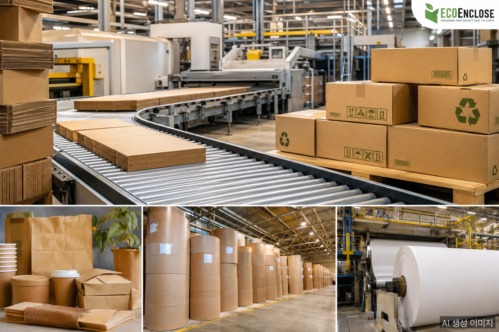

2025 was not a quiet year for the global packaging industry. The largest regulatory framework in the sector's history took effect. E-commerce demand kept pushing supply to its limits. And cost pressures were sharper than any year in recent memory. Let's start with the numbers.

## Market Size: $1.28 Trillion

The global packaging market reached **$1.28 trillion** in 2025. Paper and paperboard packaging accounted for **$417.3 billion** of that total, with corrugated packaging alone at **$198.3 billion**. Asia Pacific remained the largest single region at $430.5 billion, followed by North America.

Growth rates are steady rather than spectacular. Paper and paperboard packaging is growing at a CAGR of 4.63%, targeting $547.5 billion by 2031. Corrugated is on a 3.78% CAGR track toward $238.8 billion by 2030. Sustained expansion, not a boom.

## Regulation of the Year: EU PPWR

The biggest story in packaging in 2025 was the enforcement of the **EU Packaging and Packaging Waste Regulation (PPWR, EU 2025/40)**. Adopted in December 2024 and officially in force from February 11, 2025, its full application begins August 12, 2026: but the checklist is long.

Three core requirements stand out:

- **Recyclability**: All packaging must be recyclable in an economically viable way by 2030
- **Empty space limits**: From January 2030, grouped, transport, and e-commerce packaging must keep empty space at or below 50%
- **Recycled content tracking**: Mandatory recycled content reporting, recyclability grading, and compliance documentation

In the US, five states launched Extended Producer Responsibility (EPR) laws, signaling that the regulatory wave has crossed the Atlantic. Brand owners are already accelerating shifts to paper-based formats.

## E-Commerce: The Demand Engine

Growing e-commerce volumes are directly driving corrugated demand. Corrugated boxes dominate across food, beverage, healthcare, and e-commerce segments thanks to versatility and cost competitiveness. Recycled fiber accounted for **53.67%** of corrugated volume in 2025.

That said, recycled fiber alone can't always meet performance requirements. After roughly seven use cycles, mechanical properties degrade: so converters blend **20–30% virgin long fiber** to maintain burst strength and puncture resistance without inflating basis weight.

## Cost Pressures: OCC and Electricity Double Hit

OCC (Old Corrugated Containers) prices rose **$7.10 per ton year-over-year** in January 2025, driven by logistics bottlenecks and competing demand from Asian mills. In Europe, spot electricity prices exceeded **€150/MWh** during winter 2024–25, pushing corrugator operating costs up by as much as $28 per short ton.

Mid-sized converters unable to absorb these increases faced consolidation pressure, accelerating market share concentration among large integrated groups.

## Sustainability: Consumers Set the Agenda

**81% of consumers** now demand sustainable packaging. The bioplastics market surpassed $27.9 billion in 2025, growing at a 21.7% CAGR. Digital printing adoption accelerated, with inkjet-based solutions rapidly displacing offset lines to meet short-run, high-variety demands.

AI and digitalization now mean more than production efficiency. They are becoming tools for optimizing material use at the design stage and for verifying supply chain transparency: both requirements increasingly mandated by law.

## Looking Ahead to 2026

With PPWR's full application arriving in August 2026, European brand owners will face a concentrated wave of packaging redesign demand this year. E-commerce growth shows no signs of slowing, and cost pressures are unlikely to ease soon. The demand foundation for paper and paperboard packaging is solid: but protecting margins will require technology investment and scale.

2025 will be remembered as the year packaging's relationship with sustainability shifted from aspiration to obligation.

## FAQ

**Q: How does EU PPWR affect Korean exporters?**

From August 12, 2026, packaging used for products entering the EU must comply with PPWR requirements (Declaration of Conformity, recyclability grading). Non-compliant packaging cannot enter the EU market. Industries with high EU revenue exposure: food, electronics, cosmetics: need to act quickly.

**Q: Will the paper packaging market really keep growing?**

Paper and paperboard packaging is forecast to grow at 4.63% CAGR, reaching USD 547.5 billion by 2031. Eco-regulation tightening and e-commerce demand growth are the primary drivers.

**Q: Why does the recycled-to-virgin fiber ratio matter?**

Recycled fiber loses mechanical strength after roughly seven use cycles. Producers typically blend 20–30% virgin long fiber to maintain burst and puncture strength.

## About the Author

**PackingMaster**: Editor of PaperPackLog. Covers market trends, product insights, and technology in the paper packaging industry.

## Sources

- [Global Packaging Market Set to Reach USD 1.75 Trillion by 2035: GlobeNewswire](https://www.globenewswire.com/news-release/2026/04/24/3280892/0/en/Global-Packaging-Market-Set-to-Reach-USD-1-75-Trillion-by-2035-Driven-by-Sustainability-and-Smart-Innovation.html)
- [Paper and Paperboard Packaging Market: Mordor Intelligence](https://www.mordorintelligence.com/industry-reports/global-paper-and-paperboard-packaging-market)
- [Corrugated Board Packaging Market Size & Share: Mordor Intelligence](https://www.mordorintelligence.com/industry-reports/corrugated-board-packaging-market)
- [European Commission Publishes Final PPWR Guidance in Advance of August 2026 Application Date: Packaging Law](https://www.packaginglaw.com/news/european-commission-publishes-final-ppwr-guidance-advance-august-2026-application-date) <!-- pub: 2026-03-30 -->
- [EU PPWR – Packaging and Packaging Waste Regulation: business.gov.uk](https://www.business.gov.uk/campaign/europe/european-union-eu-regulations/eu-packaging-and-packaging-waste-regulation-eu-ppwr/)
- [Packaging Industry Statistics & Market Trends (2025-11-26): Southern Packaging](https://www.southernpackaginglp.com/blog/packaging-industry-statistics) <!-- pub: 2025-11-26 -->
