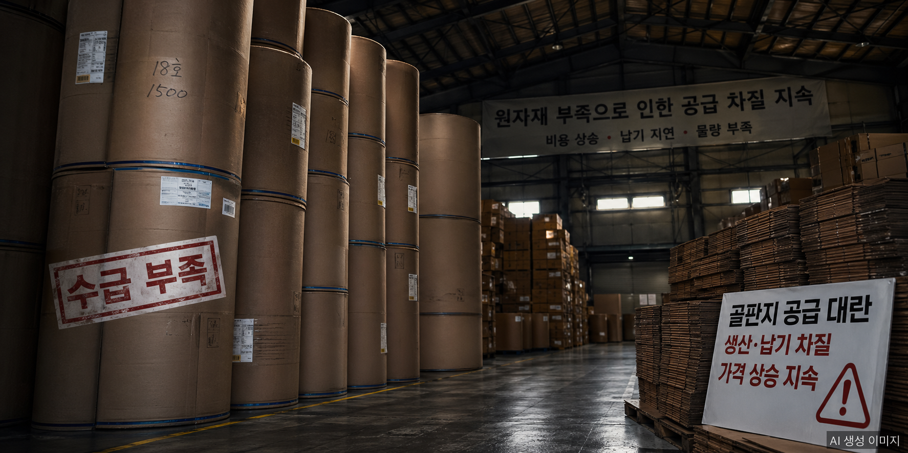

Korea's packaging industry absorbed an unusual supply shock in the first half of 2026. Corrugated base paper — the raw material inside every cardboard box — fell to roughly half its normal inventory level. The trigger: two major production facilities went offline in quick succession due to a fire and a workplace fatality, just as Middle East tensions added pressure from the raw-material side.

## Two Plants Go Dark

### Korea Export Packaging Osan Plant Fire — February 2026

A fire broke out at the Osan, Gyeonggi Province plant of Korea Export Packaging, which accounts for approximately 5% of the country's corrugated base paper supply — around 250,000 tonnes per year. Authorities projected full recovery would take several months.

### Asia Paper Sejong Plant Fatality — March 2026

On March 24, a worker died in a fall accident at the Asia Paper Sejong plant. The Ministry of Employment and Labor immediately issued a work-suspension order. The plant, which had been producing roughly 1,800 tonnes of base paper per day and has an annual capacity of 620,000 tonnes, halted operations. Production resumed on April 20 following regulatory clearance, but the month-long shutdown left a lasting gap in supply.

## Inventory Down 40%, Prices Up to 18%

According to the Korea Paper Manufacturers Association, corrugated base paper inventory stood at **152,760 tonnes** in January 2026 — **40% lower** than the same period a year earlier. The Association projected February inventory at 150,000 tonnes and March at 120,000 tonnes, roughly half the historical average of approximately 240,000 tonnes.

Base paper accounts for **60%** of corrugated box manufacturing cost. Since the disruption began, base paper prices have risen **12–18%**. Ancillary materials have followed: adhesives, printing inks, and stretch-wrap film are up **20–55%**.

## A Double Hit: Middle East Risk

The supply disruption was compounded by geopolitical factors. Rising tension in the Middle East increased the probability of Strait of Hormuz transit restrictions, driving up costs for petrochemical feedstocks. This in turn disrupted supply of plastic and film packaging materials — creating a double squeeze across the broader packaging sector.

## Industry Response: Calls for Cooperation

On April 1, the Korea Corrugated Packaging Industry Cooperative formally called on large buyers to cooperate on pricing.

> "The corrugated packaging industry is facing a dual hardship of raw material supply instability and rapid cost increases."

The Cooperative noted that approximately 2,000 small and mid-size manufacturers make up the domestic corrugated box sector, and that most cannot independently absorb input-cost increases of this scale. Corrugated boxes are consumed more than half by express delivery companies and food manufacturers — meaning price increases will eventually reach consumers.

## A Pattern of Safety Failures

The crisis reflects a broader concern beyond supply chain mechanics. In 2025, Hansol Paper's Sintanjin plant experienced both a fire (September) and a worker fatality (July). Reports of fatalities at other major producers have continued into 2026. Industry observers are calling for a comprehensive review of safety management practices across the sector.

## Outlook

Asia Paper's Sejong plant resumed output on April 20, which should gradually ease supply pressure. However, Korea Export Packaging's Osan plant remains offline with full recovery still months away. A return to normal inventory levels will take time, and upward pressure on base paper and ancillary material prices is expected to persist through at least mid-2026.

This episode has exposed the fragility of Korea's corrugated supply chain — and the interconnected consequences when industrial safety and supply resilience are both under stress at the same time.

## FAQ

**Q: Why did corrugated base paper inventory drop by 40%?**

Two major production sites went offline in quick succession: Korea Export Packaging's Osan plant after a February fire, and Asia Paper's Sejong plant under a work-suspension order following a March worker fatality. Together they account for a substantial share of domestic supply.

**Q: How long will price pressure persist?**

Asia Paper's Sejong plant resumed production on April 20, but Korea Export Packaging's Osan plant requires several more months to recover. Upward pricing pressure is likely to continue at least through the first half of 2026.

**Q: Will this crisis affect end consumers?**

Yes. Corrugated boxes are heavily used in parcel delivery and food/beverage industries, so cost increases will progressively pass through to consumer prices for packaged food and household goods.

## About the Author

**PackingMaster** — Editor of PaperPackLog. Covers market trends, product insights, and technology in the paper packaging industry.

**References**
- The Public (더퍼블릭), "Middle East Risk Meets Fire and Accident — A Double Shock for Corrugated Supply" (2026)
- 1Economy News, "Another Fatality at Asia Paper — Eight Months Later" (2026)
- Nate News, "Asia Paper Sejong Plant Resumes Production After Month-Long Suspension" (April 20, 2026)
- Korea Paper Manufacturers Association, Base Paper Supply and Inventory Data (Jan–Mar 2026)
