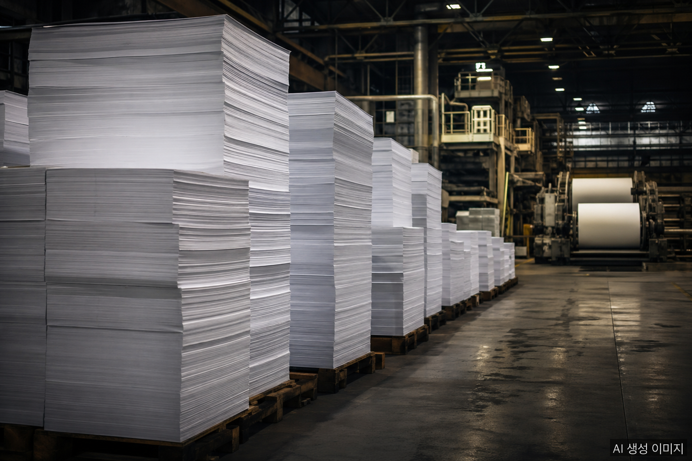
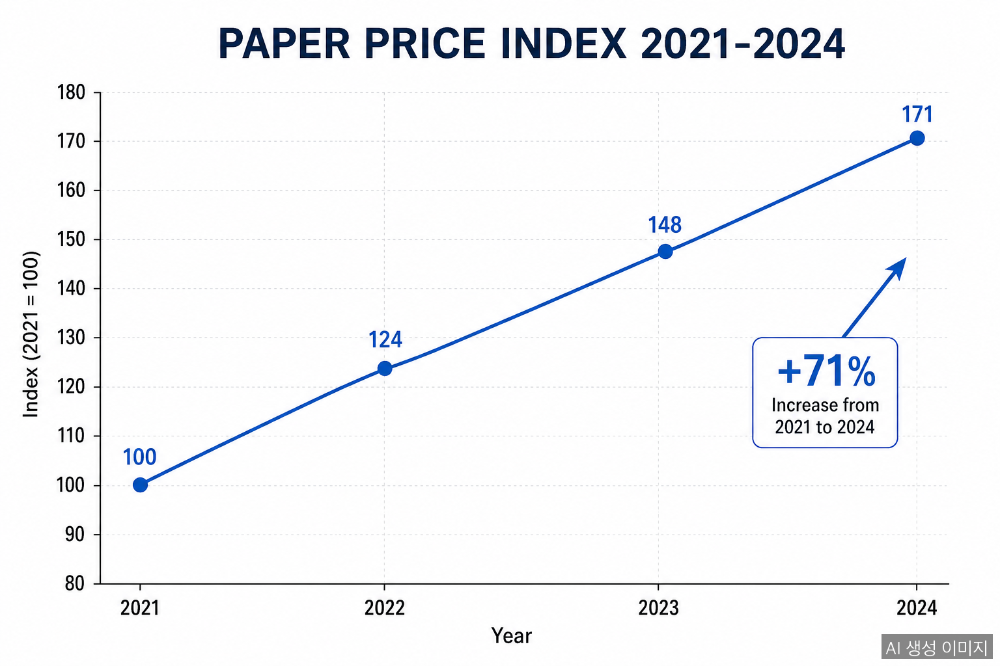
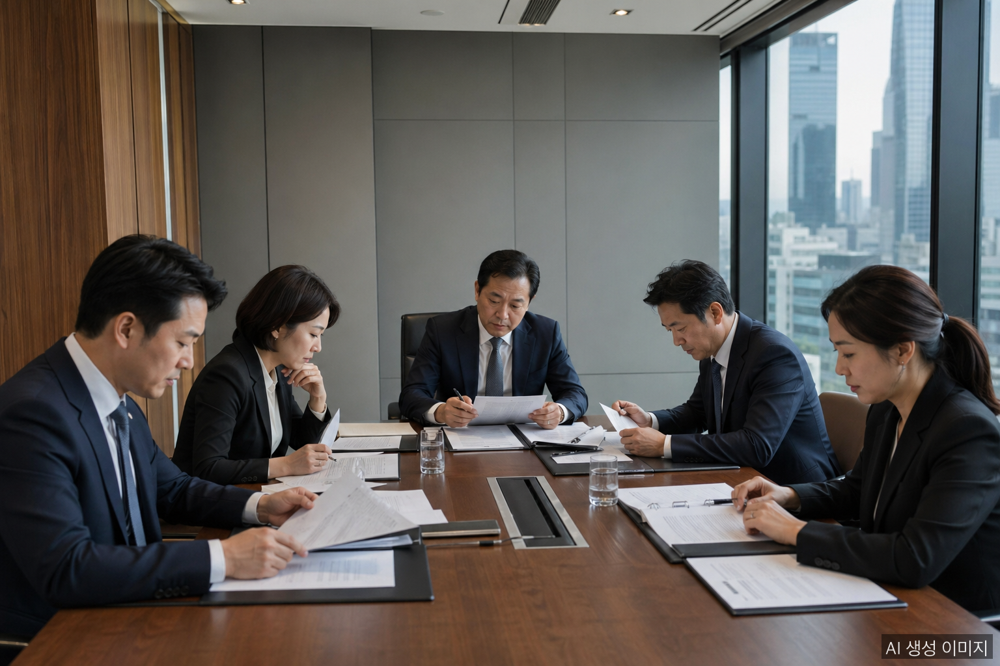

In April 2026, the Korea Fair Trade Commission (KFTC) delivered the largest-ever penalty to the domestic paper industry: a **₩338.3 billion (approximately USD 244 million)** combined fine against six paper manufacturers found guilty of coordinating printing paper prices over a period of nearly four years.

## What Happened

The KFTC found that Moorim SP, Moorim Paper, Moorim P&P, Korea Paper, Hansol Paper, and Hongwon Paper had colluded on the selling prices of printing paper from **February 2021 to December 2024**: a span of **three years and ten months**. During that time the companies held more than **60 meetings** and reached **seven separate price-increase agreements**.

The cumulative effect: printing paper prices rose by an average of **71%**. The fine is the fifth-largest in KFTC history across all industries, and the largest ever imposed on the paper sector.

## Fines by Company

| Company | Fine |
|---------|------|
| Hansol Paper | ₩142.58 billion |
| Moorim P&P | ₩91.96 billion |
| Korea Paper | ₩49.06 billion |
| Moorim Paper | ₩45.85 billion |
| Hongwon Paper | ₩8.54 billion |
| Moorim SP | ₩347 million |
| **Total** | **₩338.3 billion** |

In addition to the fines, the KFTC issued a **price re-determination order** requiring the firms to reset their prices. Korea Paper and Hongwon Paper were **referred to prosecutors** for criminal investigation.

## Who Paid the Real Price

A 71% increase in printing paper prices did not stay within the industry. The cost was passed downstream to printing shops, publishers, and ultimately consumers. Textbook, magazine, and office paper prices all climbed sharply during the cartel period: an outcome the KFTC cited as evidence of consumer harm.

## What Comes Next

The fine lands as the paper industry already faces compounding pressure: pulp prices are rising, the Korean won is weak against the dollar, and shipping costs remain elevated. The cartel ruling adds legal risk and reputational damage on top of these external pressures.

The KFTC described the action as a clear warning against using raw material cost increases as cover for coordinated pricing. The six firms now face not only penalty payments but a comprehensive review of how they set and communicate prices going forward.

## FAQ

**Q: How much did printing paper prices rise during the cartel period?**

Prices rose by an average of 71% from February 2021 through December 2024: about three years and ten months. During that time the six companies met more than 60 times and reached seven separate price-increase agreements.

**Q: Which company received the largest fine?**

Hansol Paper, with ₩142.58 billion. The other fines: Moorim P&P ₩91.96B, Korea Paper ₩49.06B, Moorim Paper ₩45.85B, Hongwon Paper ₩8.54B, and Moorim SP ₩347M.

**Q: Will paper prices come back down after the ruling?**

The KFTC issued a price re-determination order, but pulp prices, the weak won (₩1,500/USD), and 30%+ container freight increases mean a sharp decline is structurally unlikely in the short term.

## About the Author

**PackingMaster**: Editor of PaperPackLog. Covers market trends, product insights, and technology in the paper packaging industry.

**References**
- [Kookmin Ilbo, "Printing Paper Prices Up 71%: Six Paper Companies Hit With ₩338.3B Fines for Cartel" (April 23, 2026)](https://www.kmib.co.kr/article/view.asp?arcid=0029724245&code=61141111&sid1=eco)
- [Herald Economy, "Why Printing Paper Jumped 71%: Six Paper Companies' Collusion" (April 23, 2026)](https://biz.heraldcorp.com/article/10724218)
- [Aju News, "KFTC Imposes ₩338.3B on Paper Cartel: Largest in Industry History" (April 23, 2026)](https://www.ajunews.com/view/20260423112837093)
- [Financial News, "Behind Book Prices: Paper Cartel: Price Re-determination Order and ₩338.3B Fines" (April 23, 2026)](https://www.fnnews.com/news/202604231108582980)
- [Asia Today, "Paper Industry '3 Years 10 Months Collusion' Caught: KFTC ₩338.3B Fine" (April 23, 2026)](https://www.asiatoday.co.kr/kn/view.php?key=20260423010007507)
