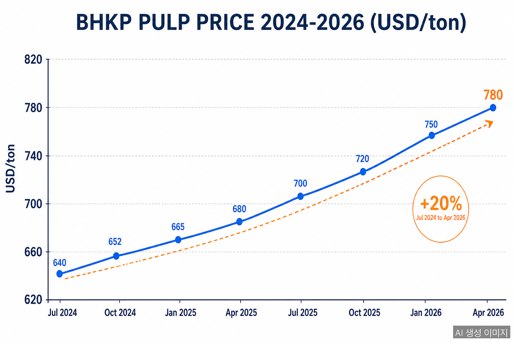
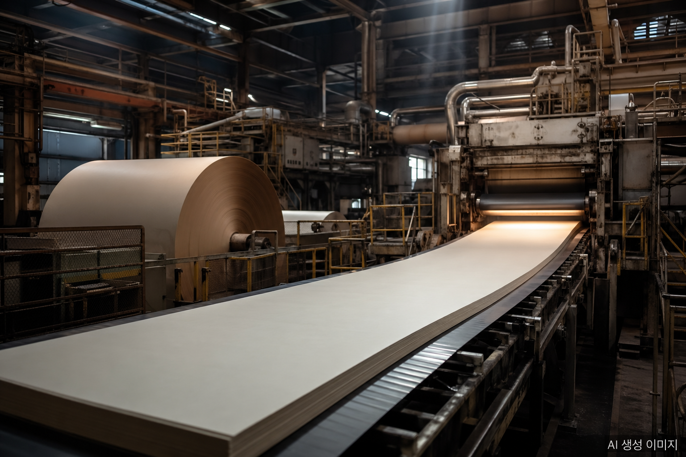

In 2026, Korea's paper industry is taking pressure from four directions at once. The cost of pulp — the core raw material — has climbed back toward record territory. The won has weakened against the dollar, ocean freight rates have jumped, and a record antitrust fine landed in April. Each pressure on its own would be manageable. Combined, they are reshaping the industry's outlook for the year.

## Pulp Prices: Up Over 20% in a Year

The benchmark Bleached Hardwood Kraft Pulp (BHKP / SBHK) traded at **USD 780 per ton** as of April 22, 2026 — up **2.63%** from March (USD 760). Compared to last July's USD 640, prices are up more than **20%**. Bleached Softwood Kraft Pulp (BSKP) is following a similar trajectory.

The drivers: tighter global supply discipline, recovering demand from China and India, and the structural shift toward paper-based eco-packaging.

## Structural Vulnerability: Korea Imports Nearly All Its Pulp

Korea's paper industry has a built-in exposure to pulp prices. With the partial exception of Moorim P&P, which sources some of its pulp internally, every other major Korean producer — Hansol Paper, Korea Paper, Hongwon Paper, and others — relies on **imports** for the bulk of its raw material.

Pulp typically accounts for **more than 50%** of the cost of printing and industrial paper grades. A USD 100/ton swing translates immediately to margin compression — there is no buffer.

## ₩1,500 Won, +30% Container Freight

The won has been hovering around **₩1,500 per dollar** through April. Since pulp imports are dollar-denominated, every won decline raises the local-currency cost of the same shipment.

Ocean freight has joined the squeeze. The **Shanghai Containerized Freight Index (SCFI)** is up **more than 30%** versus pre–Middle East tension levels. Pulp is bulky and freight-sensitive, so shipping cost increases pass directly into landed material cost.

## The April Hit: ₩338.3B Antitrust Fine

The decisive blow came on April 23, when Korea's Fair Trade Commission imposed a combined **₩338.3 billion** fine on six paper makers — Hansol Paper, Moorim P&P, Korea Paper, Moorim Paper, Hongwon Paper, and Moorim SP — for coordinating printing paper prices over a three-year, ten-month period (Feb 2021 – Dec 2024).

For an industry already pressed on raw material, currency, and freight, the fine adds a one-time cost that some observers expect will tip several producers into operating losses for 2026.

## The Limits of Price Pass-Through

In normal times, the textbook response would be price pass-through. In 2026 it is not that simple. Right after a high-profile antitrust ruling, raising prices is politically and reputationally fraught. The Fair Trade Commission has issued an explicit price-redetermination order. Downstream industries — printing, publishing, food — are pushing back.

Alternative levers being discussed include:
- **Higher-margin eco-packaging** (paper-based plastic substitutes)
- **Export expansion** (especially EU markets where eco-certification is a moat)
- **Energy efficiency and on-site generation** (cushion electricity costs)
- **Long-term pulp contracts** (hedge spot-price volatility)

## Short-Term Outlook

International pulp prices are expected to keep climbing through Q2 2026. Currency stability depends on US Federal Reserve policy and the trajectory of Middle East tensions — neither of which suggests near-term relief. Korea's paper industry is moving into a period where survival depends on absorbing external shocks while restructuring at the same time.

## FAQ

**Q: Why does a pulp price increase hit Korean paper makers harder?**

With the partial exception of Moorim P&P, which sources some pulp internally, every other major Korean producer relies entirely on imports. Global price moves pass into local cost without delay or buffer.

**Q: What share of paper manufacturing cost does pulp represent?**

For printing and industrial paper grades, pulp accounts for more than 50% of the cost. A USD 100/ton swing translates directly to margin movement — there is no cushion.

**Q: How does FX affect pulp prices for Korean buyers?**

Pulp imports are priced and settled in US dollars. With the won at around ₩1,500/USD, the same shipment costs significantly more in won terms — combining material price increases with currency depreciation as a double hit.

## About the Author

**PackingMaster** — Editor of PaperPackLog. Covers market trends, product insights, and technology in the paper packaging industry.

**References**
- [Herald Economy, "Logistics, Pulp, Energy Costs Plus Fines — Paper Companies Face a Gloomy 2026" (2026)](https://biz.heraldcorp.com/article/10724545)
- [Herald Economy, "Logistics, Materials, Fines — Paper Industry Looking at Operating Losses" (2026)](https://biz.heraldcorp.com/article/10726232)
- [Trading Economics, Kraft Pulp Price Chart](https://ko.tradingeconomics.com/commodity/kraft-pulp)
- [Korea International Trade Association KOIMA, Commodity Price Index](https://www.koimaindex.com/)
- [Korea Paper Manufacturers Association, Monthly Supply Status](http://www.paper.or.kr/sub_5/5_1_2.php)
