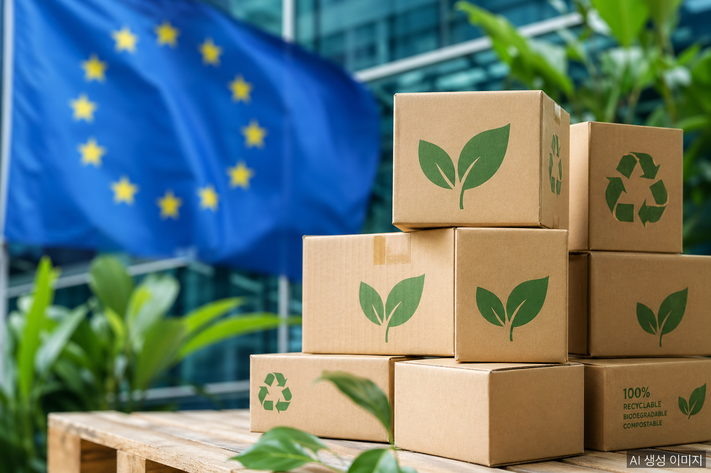
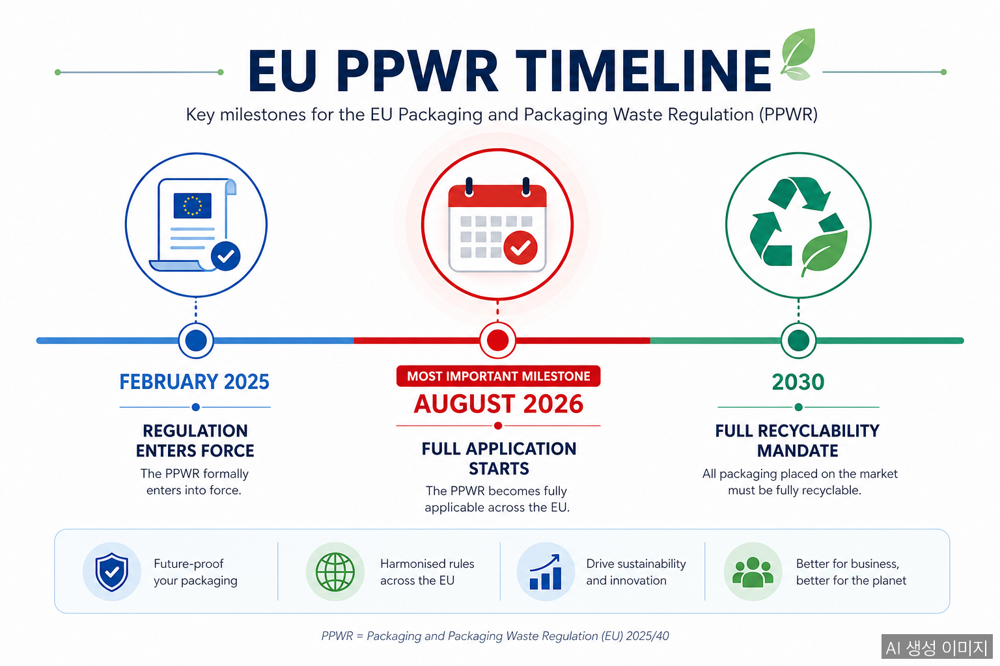
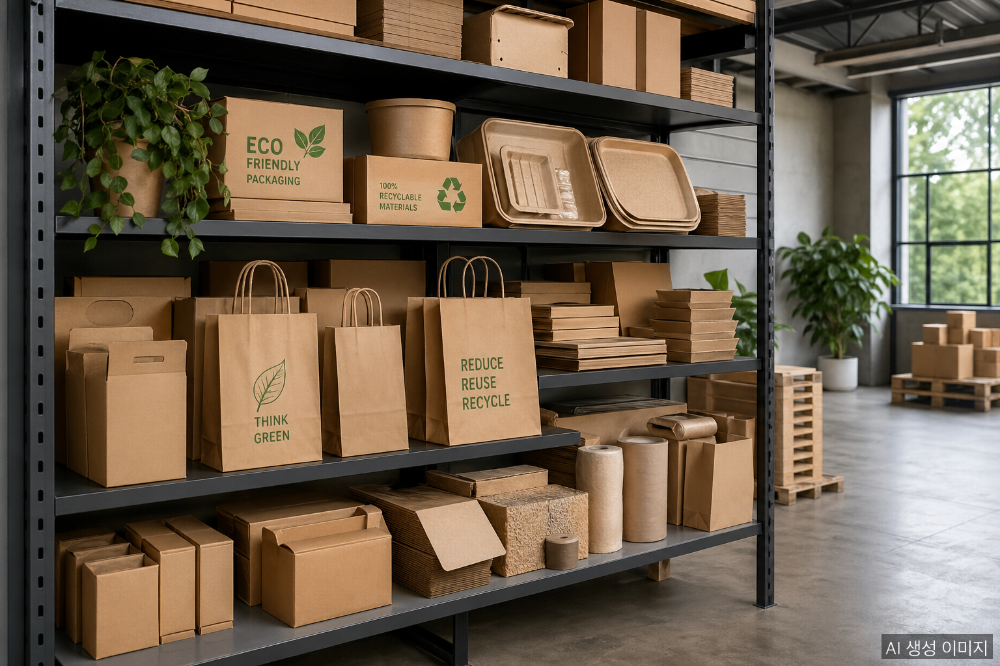

August 12, 2026 is a date every exporter shipping packaged goods into the European Union needs to have circled on the calendar. That is when the **Packaging and Packaging Waste Regulation (PPWR, EU 2025/40)** enters full application — and packaging that does not comply cannot legally enter the EU market.

## What Is the PPWR?

The PPWR replaces the long-standing Directive 94/62/EC on packaging and packaging waste. Unlike a directive, which required member states to pass their own implementing legislation, this regulation applies directly and uniformly across all 27 EU member states from the moment it takes effect.

The regulation entered into force on **February 11, 2025**, with most requirements applying from **August 12, 2026**.

## What Changes on August 12

### 1. Declaration of Conformity and Technical Documentation
Every type of packaging placed on the EU market must be accompanied by a **Declaration of Conformity (DoC)** and **Technical Documentation (TD)** proving compliance with PPWR requirements. These documents must be available for inspection — the burden is on the manufacturer or importer.

### 2. PFAS Restrictions
Intentional use of per- and polyfluoroalkyl substances (PFAS) in packaging is prohibited. Food packaging that relies on PFAS coatings for grease or moisture resistance will need to switch to compliant alternatives.

### 3. Empty Space Limits for E-Commerce Packaging
Grouped, transport, and e-commerce packaging must keep unused (dead) space to a maximum of **40% of total package volume**. Excessive filler material and oversized boxes are directly targeted.

### 4. Full Recyclability by 2030
By 2030, all packaging placed on the EU market must be technically and economically recyclable. The highest recyclability grade under the PPWR classification is **Grade A** — the benchmark that leading manufacturers are now designing toward.

## How Korean Exporters Are Responding

### Difficulty Finding Compliant Materials
Korean food, manufacturing, and distribution companies exporting to Europe are struggling to identify packaging materials that meet PPWR requirements. Smaller exporters face particular challenges: less bargaining power with suppliers and fewer alternative material options than larger firms.

### Industry Seminars Begin
Hansol Paper recently hosted a technical seminar for around 60 representatives from major customers including CJ Logistics, Lotte Wellfood, GS Retail, and Ottogi, focused specifically on PPWR compliance. The company presented its PPWR-aligned secondary packaging line — including a product rated Grade A for recyclability — along with barrier packaging and eco-friendly insulated box alternatives.

## Compliance Checklist for Exporters

- **Inventory all EU-bound packaging**: identify every pack format that touches the European market
- **Check for PFAS**: audit coating and barrier materials for PFAS content
- **Prepare the Declaration of Conformity**: work with material suppliers to assemble technical documentation
- **Assess recyclability grade**: determine where current packaging stands relative to Grade A
- **Run alternative material trials**: test and validate compliant substitutes before the deadline

Approximately three months remain before August 12. Given that documentation preparation and material qualification typically take several months, exporters who have not started will face real risk of shipment delays or order cancellations from European buyers.

## FAQ

**Q: When exactly does PPWR take effect?**

EU PPWR (Regulation 2025/40) entered into force on February 11, 2025. Most core obligations apply from **August 12, 2026**. Packaging placed on the EU market from that date must meet PPWR requirements.

**Q: Who must prepare the Declaration of Conformity?**

The manufacturer or importer placing packaged goods on the EU market is responsible for preparing and maintaining both the Declaration of Conformity and the Technical Documentation. Coordination with material suppliers is required to assemble the technical file.

**Q: Are PFAS banned from all packaging?**

Intentionally added PFAS are prohibited. Food packaging that has relied on PFAS coatings for grease or moisture resistance — paper straws, single-use food containers — must transition to compliant alternatives before the August deadline.

## About the Author

**PackingMaster** — Editor of PaperPackLog. Covers market trends, product insights, and technology in the paper packaging industry.

**References**
- [Herald Korea, "Hansol Paper Presents PPWR Response Strategy" (April 22, 2026)](https://heraldk.com/2026/04/22/%ED%95%9C%EC%86%94%EC%A0%9C%EC%A7%80-8%EC%9B%94-%EC%8B%9C%ED%96%89-%E2%80%98%EC%9C%A0%EB%9F%BD-%ED%8F%AC%EC%9E%A5%EA%B7%9C%EC%A0%9C%E2%80%99-%EB%8C%80%EC%9D%91%EC%A0%84%EB%9E%B5-%EC%A0%9C%EC%8B%9C/)
- [Greenberg Traurig, "EU Packaging and Packaging Waste Regulation: New Compliance Requirements for E-Commerce" (2025)](https://www.gtlaw.com/en/insights/2025/8/eu-packaging-and-packaging-waste-regulation-new-compliance-requirements-for-e-commerce)
- [KJob News, "EU Packaging Regulation Tightens, Korean Companies on Alert" (2026)](https://www.kjob.news/news/480082)
- [KATI Food Export Info, "European Eco-Friendly Packaging Regulation Amendment"](https://www.kati.net/board/exportNewsView.do?board_seq=100549&menu_dept2=35&menu_dept3=71)
