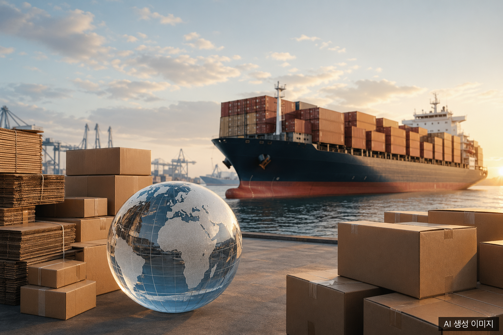
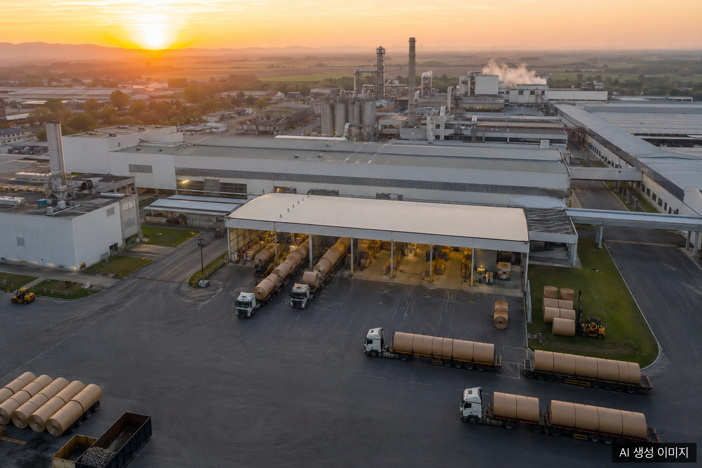
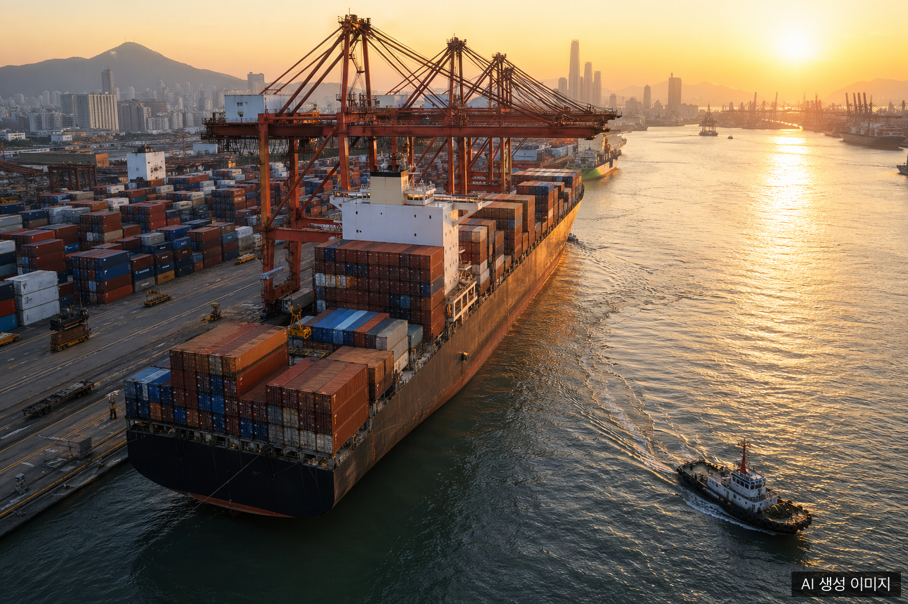

Plastic regulation tightens, e-commerce keeps growing, and paper packaging sits squarely in the middle. Here is a 2026 snapshot and a 2031 outlook based only on publicly available reports.

## Market Size: Estimates Differ, Direction Aligns

Estimates of the global paper packaging market vary by research house. Sorted conservatively, the most recent reports show the following.

- Mordor Intelligence (published January 2026): **USD 479.96 billion in 2026**, growing to **USD 601.73 billion in 2031** at a 4.62% CAGR.
- Grand View Research: **USD 435.73 billion in 2026**, reaching **USD 611.66 billion by 2033** at a 5.0% CAGR.
- Fortune Business Insights (published April 2026): **USD 408.97 billion in 2026**, scaling to **USD 591.67 billion by 2034** at a 4.72% CAGR.

The differences trace back to scope (whether containerboard, paperboard, and cartons are all included) and currency conversion methods. This article uses the Mordor Intelligence range of **USD 480 to 600 billion** as headline numbers, while noting that even the most conservative estimate clears USD 590 billion in the early 2030s.

The corrugated subsegment alone is sized between **USD 185 billion and USD 294 billion in 2026** depending on definition, with CAGRs in the 4 to 5 percent band.

## Growth Drivers: Regulation, Channel, and Cost Working in Parallel

Four forces compound in the same direction.

First, **paper-favoring regulation**. The EU Packaging and Packaging Waste Regulation (PPWR, 2025/40) takes full effect on 12 August 2026. Headline rules include a 50 percent empty-space cap, recyclability grading, and recycled-content mandates. In the United States, five state EPR laws are now active, accelerating fiber-based substitution.

Second, **e-commerce channel expansion**. Demand for corrugated boxes and paper mailers continues to climb. According to one industry report, e-commerce will hold a 21.88 percent share of paper packaging end-use in 2026, the second largest segment.

Third, **buyer-side preference**. One report finds that 64 percent of companies are actively shifting to sustainable paper-based packaging because of regulatory pressure. Food, beverage, pharmaceutical, and personal care lead the conversion.

Fourth, **cost stabilization**. Old corrugated container (OCC) prices rose USD 7.10 per ton in early 2025 and have since plateaued, while pulp prices entered a short-term correction in Q1 2026. Power and logistics costs still vary by region.

## Regional Structure: Asia Pacific at the Center

The regional picture is consistent. Multiple reports converge on **Asia Pacific holding roughly 42 percent of global paper packaging demand**. Mordor Intelligence's flagship report places the share even higher at 47.62 percent in 2025, while narrower-scope reports fall in the 38 to 42 percent band.

The core markets are:

- **China**: roughly **USD 84.92 billion in 2026** with a 6.4 percent CAGR through 2033. The single largest country market at 17.8 percent of global paper packaging demand.
- **India**: roughly **USD 18.62 billion in 2026** and the fastest-growing market in Asia Pacific, supported by agro-residue fiber policies and FMCG penetration.
- **Southeast Asia**: Vietnam, Indonesia, and Thailand drive demand through food and electronics export packaging.

North America and Europe trail Asia Pacific in volume but lead on regulation-driven premium positioning. Recycled-content credentials and FSC or PEFC certifications increasingly translate directly into pricing power.

## Implications for Korean Companies: Three Strategic Axes

Korea accounts for only 1.5 to 2 percent of the global paper packaging market, but Korean converters sit deep inside the primary packaging supply chains of major export brands in food, electronics, and cosmetics. Three strategic axes will shape the next five years.

1. **PPWR compliance infrastructure**: declarations of conformity, recyclability grading, and Digital Product Passport (DPP) data integrity. Converters with EU-bound lines need systematized workflows in place before late 2026.
2. **Recycled-fiber quality control**: recycled fiber already exceeds 53 percent in many lines, but mechanical strength drops after about seven cycles. Standardizing a 20 to 30 percent virgin long-fiber blend protects burst and puncture performance.
3. **Premium certification line-ups**: FSC Mix and higher are now cited directly in customer ESG disclosures. Holding the certification has become an entry barrier, not a marketing extra.

The price-only competition phase is largely over. The next round will be decided by **the depth of compliance data and certification coverage**.

## Frequently Asked Questions

**Q: What is the exact global paper packaging market size in 2026?**

Estimates range from USD 408.97 billion to USD 479.96 billion depending on scope. This article uses Mordor Intelligence's USD 479.96 billion as the headline figure because it captures the broadest definition.

**Q: Which report supports the 42 percent Asia Pacific share?**

The Asia Pacific Paper Packaging Market report (Mordor Intelligence) lists 42 percent of global demand for the region. The same publisher's global flagship report shows 47.62 percent in 2025, with the gap explained by differences in scope.

**Q: What should Korean exporters prioritize first?**

If you ship to the EU, PPWR conformity declarations and recyclability grading data systems come first. The 12 August 2026 enforcement date means the first wave of system rollouts must be complete before that.

## About the Author

**PackingMaster**: Editor of PaperPackLog. Covers market trends, product insights, and technology in the paper packaging industry.

## References

- [Paper Packaging Industry Global, Market Trends, Size & Forecast Report (Mordor Intelligence)](https://www.mordorintelligence.com/industry-reports/paper-packaging-market) <!-- pub: 2026-01-06 -->
- [Paper Packaging Market Size, Share, Industry Report 2033 (Grand View Research)](https://www.grandviewresearch.com/industry-analysis/paper-packaging-market) <!-- pub: 2026-02-15 -->
- [Paper Packaging Market Size, Share, Trends & Growth (Fortune Business Insights)](https://www.fortunebusinessinsights.com/paper-packaging-market-107316) <!-- pub: 2026-04-13 -->
- [Asia Pacific Paper Packaging Market Size, Trends & Forecast (Mordor Intelligence)](https://www.mordorintelligence.com/industry-reports/asia-pacific-paper-packaging-market) <!-- pub: 2026-01-20 -->
- [China Paper Packaging Market Size & Outlook 2026 to 2033 (Grand View Research)](https://www.grandviewresearch.com/horizon/outlook/paper-packaging-market/china) <!-- pub: 2026-02-15 -->
- [Paper Packaging Market Outlook & Forecast 2026 to 2036 (Future Market Insights)](https://www.futuremarketinsights.com/reports/paper-packaging-market) <!-- pub: 2026-03-10 -->
- [Global Packaging Market Outlook 2026 (Fastmarkets, public summary)](https://www.fastmarkets.com/insights/global-packaging-market-outlook-2026-gate/) <!-- pub: 2026-01-15 -->
