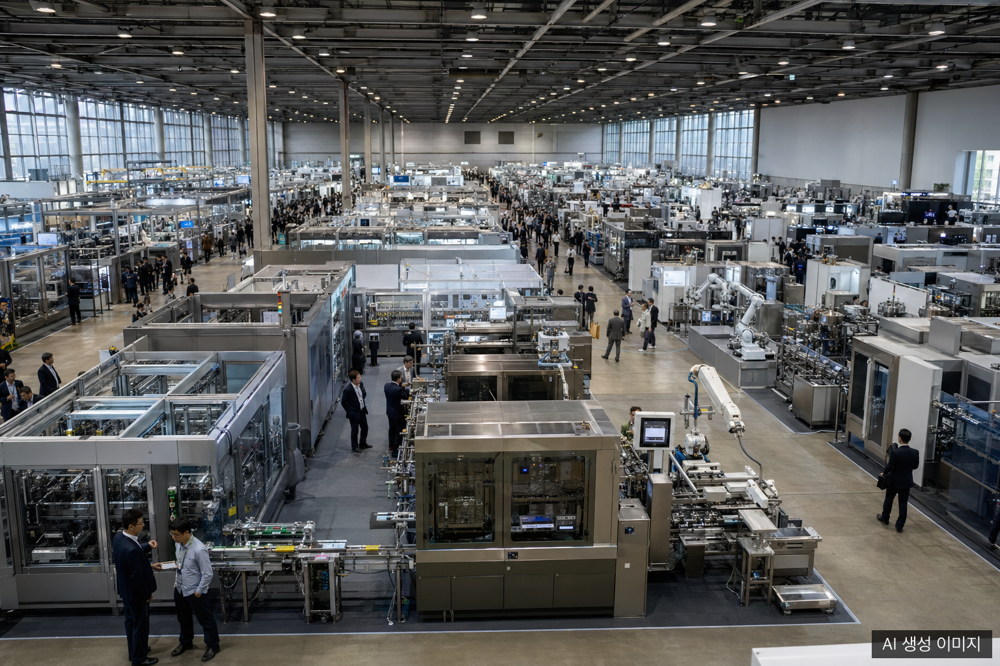
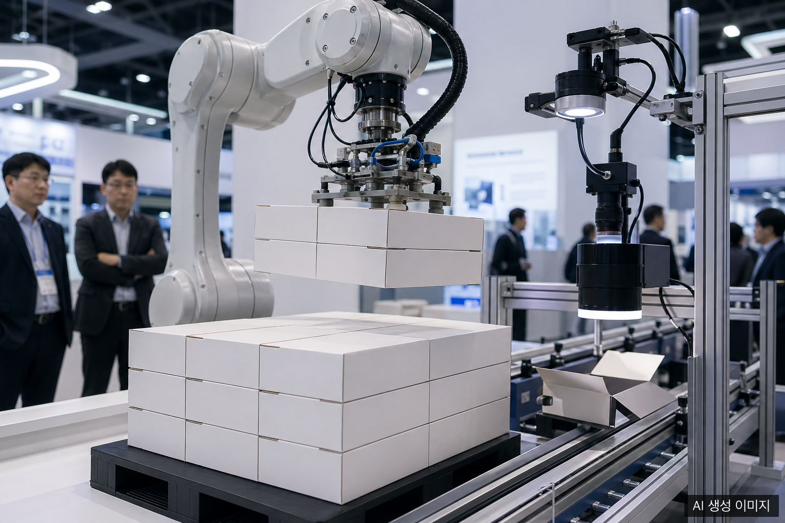
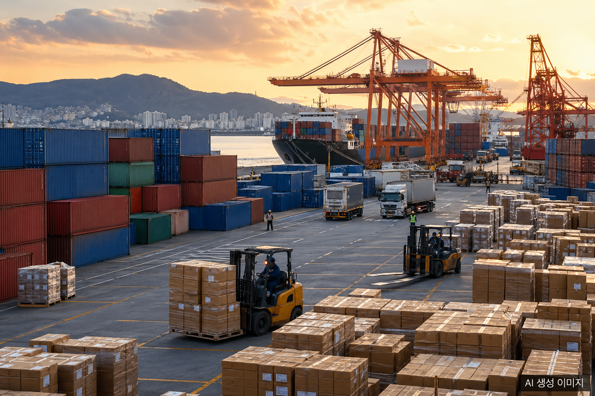

KOREA PACK and ICPI WEEK 2026 opened on March 31 at KINTEX in Goyang, Gyeonggi Province, and ran through April 3. Co-hosted by the Korea Packaging Machinery Association and Kyungyon Exhibition, the show used both halls of KINTEX (about 100,000 square meters) and brought together 1,500 companies from 24 countries across 5,000 booths. It was the largest edition ever, designed to cover the entire value chain from R&D and manufacturing through packaging, logistics, and cold chain on a single floor plan.

## KOREA PACK and ICPI WEEK 2026 by the Numbers

- **Dates**: March 31 to April 3, 2026 (4 days)
- **Venue**: KINTEX Halls 1 and 2, Goyang, Gyeonggi Province
- **Scale**: 1,500 exhibitors from 24 countries, 5,000 booths
- **Floor space**: about 100,000 square meters
- **Expected visitors**: more than 60,000
- **Side events**: more than 150 expert seminars and conferences

The standout feature was integration. Instead of running KOREA PACK alone, organizers paired it with ICPI WEEK, which covers pharmaceuticals, biotech, cosmetics, chemicals, lab science, cold chain, and dark factories. Buyers could compare materials, machines, printing, automation, and logistics solutions in a single visit.

## Show Layout: Ten Specialized Fairs Under One Roof

The 2026 edition was structured as ten specialized fairs spread across two halls, signaling that Korea's packaging sector is moving beyond simple box production into precision processing, data-driven quality control, and cold chain logistics.

| Hall | Specialized fairs |
|------|-------------------|
| Hall 1 | KOREA PACK, ESG PACK, COPHEX, KOREA CHEM |
| Hall 2 | KOREA LAB, KOREA PHARM and BIO, CI KOREA, KOREA MAT, KOREA COLD CHAIN, KOREA DARK FACTORY |

The ESG PACK zone drew particular attention. With the EU Packaging and Packaging Waste Regulation (PPWR) entering force in August, exporters used the show to verify compliance strategies on the floor.

## Trend 1: ESG and Sustainable Packaging Take Center Stage

Sustainability led the agenda. Major Korean paper packaging suppliers including Dongwon Systems and Samryung Materials pushed designs that prioritize recyclability while keeping product protection intact. The shift from single-use plastics to paper-based, reusable structures was visible across major booths.

ESG PACK and KOREA CHEM showcased solutions such as:

- Recycled pulp content labeling and carbon footprint disclosure
- Mono-material corrugated boards and coatings
- Digital Product Passport (DPP) ready labels combining RFID and QR codes
- Label-less and easy-release adhesive labels for higher recycling yields

Beyond PPWR, RE100 and carbon neutrality certifications featured heavily, confirming that Korean packaging suppliers are aligning quickly with global regulations rather than reacting to them.

## Trend 2: AI Vision and Robotic Automation

Automation was the second pillar. The Korea Packaging Machinery Association used the opening ceremony to argue that smart packaging combined with AI, robotics, and carbon neutrality technology is now the survival kit for the industry. The show floor backed that up.

- AI vision inspection for print defects, board cracks, and label misalignment
- Robotic palletizing systems enabling lights-out night operations
- Automated tooling change for die-cutters and slitters
- Digital printing lines for short-run, high-mix production

Eight equipment makers including Daeun Industry, Heung-A Machinery, Repack, Countec, Sejong Pharmatech, PTK, Youngtek Pack, and Cubezel ran a consortium demo covering filling, packaging, and shipping in a single integrated line. The message was clear: with rising labor costs and chronic workforce shortages, automation is no longer optional.

## Trend 3: Digital Transformation and Data-Driven Packaging

The third theme was digital transformation. The Ministry of Trade, Industry and Energy framed packaging as evolving toward data-driven intelligent packaging, meaning the floor showed not only print design changes but full integration between production lines and distribution tracking.

- MES and WMS integration linking production output to inventory in real time
- IoT temperature and humidity tracking embedded in cold chain logistics
- Dark factory zone showing fully unmanned manufacturing cells
- E-commerce optimized packaging with right-sized boxes adjusted to product dimensions

KOREA COLD CHAIN and KOREA DARK FACTORY brought fresh logistics, pharma cold chain, and unmanned warehouse operations into a single curated zone, reflecting where capital is flowing inside Korean industry.

## What This Means for Korean Packaging Exports

Read together, the show points to four levers Korean packaging suppliers can pull to grow exports.

1. **K-brand halo**: After defense and K-culture, the Korea Packaging Machinery Association now claims that Korean packaging machines and materials are gaining global trust on their own merit.
2. **EU PPWR readiness**: With the August enforcement date approaching, certified recyclability, carbon data, and mono-material design are becoming default expectations. Companies that prepared early are positioned to win European tenders.
3. **Automation demand in emerging markets**: Rising wages in Southeast Asia and Latin America are accelerating automation adoption, opening room for Korean mid-sized packaging machinery exporters.
4. **Cold chain and pharma packaging**: Global biopharma growth is expanding the addressable market for precision cold chain and GMP-grade cleanroom packaging from Korea.

Caveats remain. China's WEPACK pulled in over 130,000 visitors, Japanese suppliers still lead on certain automation niches, and Southeast Asia is closing the price gap. The realistic Korean play is differentiation on sustainability and digital integration rather than competing on unit price.

## Frequently Asked Questions

**Q: What was the headline feature of KOREA PACK and ICPI WEEK 2026?**

It was the largest edition ever with 1,500 companies from 24 countries spread across 5,000 booths. The integration of KOREA PACK with ICPI WEEK let visitors review packaging, pharmaceutical, biotech, chemical, cold chain, and dark factory solutions in one trip.

**Q: What were the top three trends?**

First, ESG-aligned sustainable packaging including recyclability, carbon labeling, and EU PPWR readiness. Second, AI vision combined with robotic automation lines. Third, data-driven digital transformation through MES, WMS, and IoT-enabled cold chain.

**Q: How is Korea's packaging export competitiveness viewed today?**

The Korea Packaging Machinery Association argues that the K-brand halo is lifting trust in Korean packaging machines and materials. The realistic differentiator versus China and Japan is the combination of sustainability credentials and digital integration capability.

**Q: When is the next edition?**

KOREA PACK is expected to return at KINTEX in spring 2027. The integrated format with ICPI WEEK on a biennial basis is to be confirmed. Korean paper packaging suppliers targeting export growth are advised to commit booth space early.

## About the Author

**PackingMaster**: editor of PaperPackLog. Curates market trends, product information, and technical insights from the paper packaging industry.

**References**

- [AVING, "KOREA PACK and ICPI WEEK 2026 opens at KINTEX with 1,500 companies from 24 countries" (2026.03.31)](https://kr.aving.net/news/articleView.html?idxno=1810047) <!-- pub: 2026-03-31 -->
- [KIDD, "KOREA PACK and ICPI WEEK 2026 opens, from packaging to biotech and dark factories" (2026.03.31)](https://kidd.co.kr/news/245476) <!-- pub: 2026-03-31 -->
- [elec4, "KOREA PACK and ICPI WEEK 2026 brings manufacturing to logistics under one roof" (2026.04.01)](https://elec4.co.kr/contents/article_detail?article_idx=36298) <!-- pub: 2026-04-01 -->
- [Industry Journal, "ICPI WEEK 2026 opens at KINTEX, from pharma and biotech to smart logistics" (2026.03.31)](https://industryjournal.co.kr/news/245474) <!-- pub: 2026-03-31 -->
- [The K Beauty Science, "Korea Pack connects the full manufacturing process beyond packaging" (2026.03.22)](https://www.thekbs.co.kr/news/articleView.html?idxno=14491) <!-- pub: 2026-03-22 -->
- [Box4U Blog, "KOREA PACK 2026 visit notes" (2026.04.05)](https://blog.box4u.co.kr/koreapack-2026) <!-- pub: 2026-04-05 -->
- [KOREA PACK Official Site](https://koreapack.org/eng/main.asp) <!-- pub: 2026-03-31 -->
