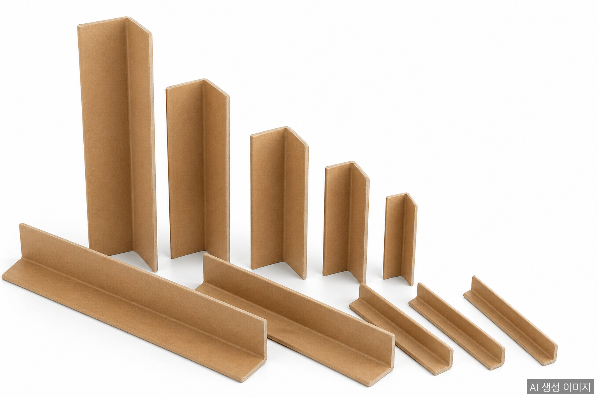
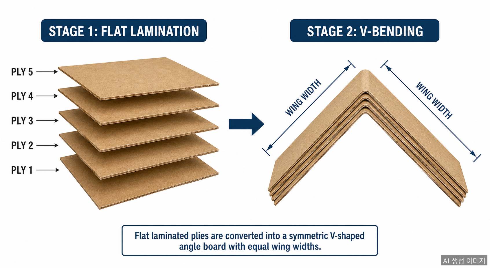
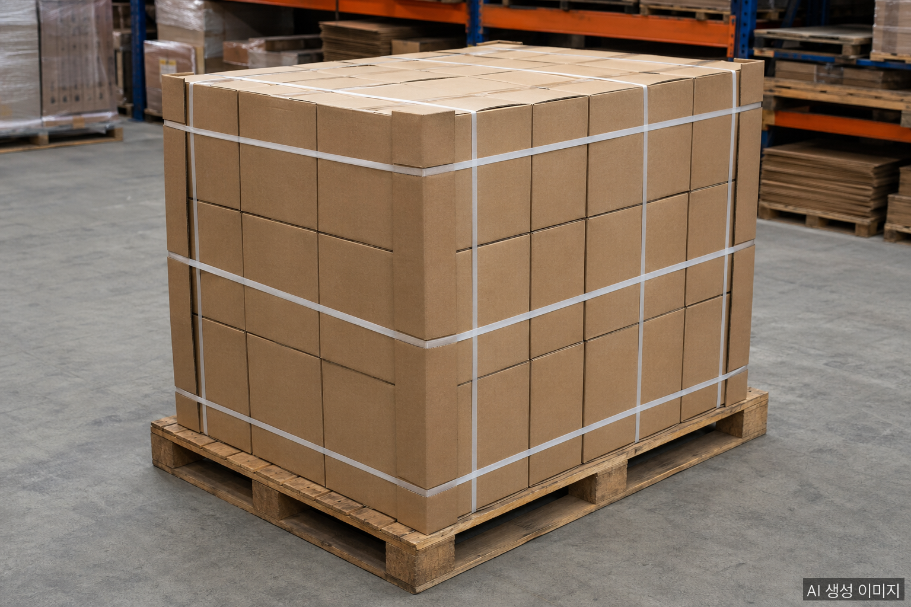

Something stands between your shipment and the damage caused by strapping pressure, stacking loads, and rough handling. It looks like a simple folded strip of paper: but the paper angle board simultaneously solves edge protection and load distribution in one lightweight, recyclable piece.

## What Is a Paper Angle Board?

A paper angle board (also called an edge protector, corner board, or angleboard) is a packaging protection component formed by laminating multiple plies of recycled kraft paper with water-based adhesives, then continuously pressing the laminated sheet into a rigid **V-shaped profile**.

In Korean industry the product goes by several names: 앵글보드, 코너보호대, and 엣지가드. The core structure is the same: each paper ply wraps around the previous one in concentric V-shapes, building up wall thickness and compressive strength in the thickness direction through a V-bending process.

## Main Types

### 1. Standard
Caliper range of 2–5T. The most common application is box-corner protection and load distribution under pallet strapping bands, preventing the strap from cutting into cardboard edges.

### 2. Heavy-Duty
Caliper of 6T and above. Used inside the packaging of large appliances, furniture, and building materials to carry vertical stacking loads across multiple pallet tiers.

### 3. Moisture-Resistant
Standard angle boards with a poly-coating or wax surface treatment. Maintains structural strength in cold-chain logistics, refrigerated storage, and export containers where high humidity would degrade untreated board.

## Specifications

| Parameter | Available Range |
|-----------|----------------|
| Wing Width | 30×30 mm to 150×150 mm |
| Caliper (Thickness) | 2T to 9T |
| Length | 100 mm to 4,000 mm |

Wing width and caliper are selected based on product weight, impact requirements, and stacking height. Lightweight cartons typically use narrower, thinner boards; heavy or multi-tier loads call for wider wings and higher calipers.

## Industry Applications

**Logistics & Parcel Delivery**
Without angle boards, strapping bands concentrate stress at cardboard edges, crushing corners. With boards in place, the load spreads across the face of the ply stack, keeping pallets stable and cartons intact.

**Home Appliances & Electronics**
Large appliances: refrigerators, washing machines, flat-panel TVs: use heavy-duty angle boards at the top and bottom interior corners of their packaging to absorb vertical stacking loads in warehouse storage.

**Furniture**
Wood panels, glass sheets, and marble slabs are wrapped with angle boards along their long edges to prevent scratches and chipping during transport.

**Food & Beverage**
Refrigerated pallets use moisture-resistant boards to maintain stability without the board absorbing condensation and losing its strength.

**Construction Materials & Steel**
Rolled or coil-form steel sheets and aluminum panels use V-profile boards to protect edges from nicks and deformation during shipment.

## Sustainability

Paper angle boards are manufactured primarily from recycled old corrugated containers (OCC). Compared to plastic corner guards and EPS foam cushioning, they are easy to separate for recycling and are biodegradable: making them a key product in the shift toward ESG-compliant packaging.

Demand for paper-based protective materials is expected to grow steadily as the EU PPWR regulation comes into force and Korea tightens its single-use plastics rules.

## Selection Checklist

- **Product weight**: Light cartons → thinner caliper / Heavy goods → heavy-duty grade
- **Wing width**: Small boxes → 30–50 mm / Large products → 75 mm and above
- **Stacking tiers**: Two or more → consider thicker caliper
- **Environment**: Cold chain or export container → moisture-resistant grade
- **Non-standard dimensions**: Custom lengths and wing widths available up to 150×150 mm and 4,000 mm

## FAQ

**Q: How is a paper angle board different from a corrugated box?**

A corrugated box is a container that holds the product itself; a paper angle board is a separate reinforcement that protects the corners of a box or product. Because multiple kraft paper plies are laminated and formed into a V-shape, compressive strength is far higher than ordinary paper of the same thickness.

**Q: How do I choose between 2T and 9T thickness?**

Match thickness to product weight and stacking tier. Standard parcel boxes typically use 2–3T; heavy appliances or multi-tier pallet stacking calls for 5T or higher heavy-duty grade.

**Q: Are eco-certified versions available?**

Yes. Paper angle boards are made primarily from recycled kraft paper (OCC) and are recyclable and biodegradable. Versions made from FSC-certified raw material are also available, which is useful for EU PPWR-aligned export packaging.

## About the Author

**PackingMaster**: Editor of PaperPackLog. Covers market trends, product insights, and technology in the paper packaging industry, with content that connects field perspective and data.

**References**
- [Ysung Co., Ltd., Paper Angle Board Product Specifications](https://www.ysung.com/products?lang=en)
- [Future Market Insights, "Paper Edge Protector Market (2026-2036)" (2026-04-11)](https://www.futuremarketinsights.com/reports/paper-edge-protectors-market) <!-- pub: 2026-04-11 -->
- [Greif, "Edge and Angle Board Product Guide"](https://www.greif.com/edge-and-angle-board/)
- [Korea Paper Manufacturers Association, Monthly Supply Status](http://www.paper.or.kr/sub_5/5_1_2.php)
