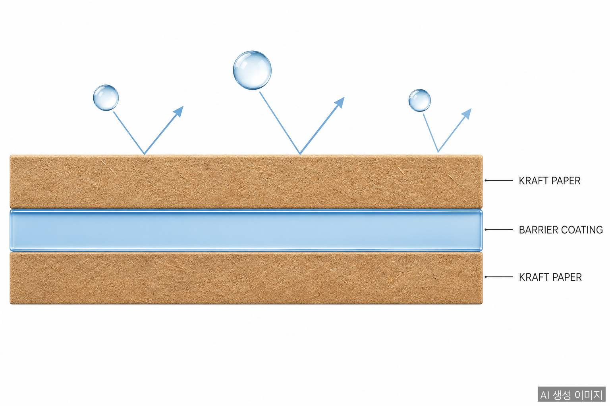
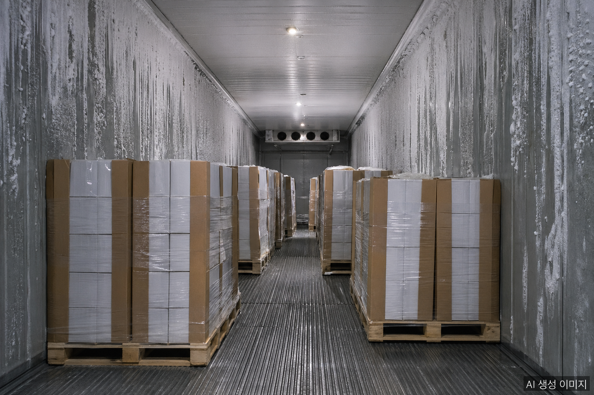

A waterproof paper angle board is a paper angle board with a moisture barrier coating applied to its surface, allowing it to maintain strength and form in humid environments. Where standard angle boards rely on a V-shaped laminated structure for compressive strength, the waterproof version adds a coating layer that addresses paper's core weakness — water, humidity, and condensation.

## Why Waterproofing Matters

Paper angle boards are fundamentally laminated multi-ply kraft paper. The structure is strong, but exposure to moisture creates predictable problems:

- **Delamination** — adhesives between plies weaken, the V-profile loses its integrity
- **Compressive strength loss** — wet paper retains only 50–70% of dry-state strength
- **Mold and bacteria growth** — a hygiene issue for food and beverage packaging
- **Stains and surface damage** — visible on premium appliance and furniture packaging

Standard angle boards reach their limits in the following environments:

| Environment | Risk Factor |
|-------------|-------------|
| Cold-chain warehouses | Surface condensation |
| Ocean export containers | Internal humidity, condensation in transit |
| Food and beverage pallets | Liquid leaks, washdown water |
| Produce and floral logistics | High humidity, direct moisture contact |
| Southeast Asia / Latin America export | Monsoon-season port storage |

## Three Coating Types — How They Work

### 1. Polyethylene (PE) Coating

The most common and least expensive method. A thin polyethylene film is laminated onto the paper surface, blocking moisture penetration.

- **Features**: low cost, strong waterproofing, stable supply
- **Thickness**: 10–30 μm
- **Drawback**: paper and plastic are bonded, making **recycling difficult**. Special separation processing is required, or the material is sent to disposal.

### 2. Wax Coating

Paraffin wax or beeswax is applied via heat to penetrate between paper fibers.

- **Features**: 10–25% coating weight ratio, 5–10 μm thickness
- **Barrier performance**: beeswax improves water vapor barrier by approximately **77%**
- **Pros**: food-grade options available, relatively eco-friendly depending on formulation
- **Cons**: wax can melt at high temperatures; standard recycling lines require pre-treatment

### 3. Eco-Friendly Barrier Coatings (New Generation)

Driven by the environmental burden of traditional PE and wax, water-based barrier coatings have emerged as the new generation.

- **Examples**: Cartaseal VWAF, EcoShield, TopScreen
- **Features**: water-based, fluorine-free, some derived from vegetable oils
- **Pros**: **repulpable → recyclable through standard channels**, free of MOSH/MOAH and other harmful compounds
- **Cons**: higher cost than PE/wax; limited supplier base

## Industry Application Guide

**Cold-Chain Logistics**
Dairy, meat, and ice cream pallets generate heavy condensation, making waterproof coating effectively mandatory. PE coating is most common, though brands emphasizing food safety prefer wax or eco-friendly coatings.

**Ocean Export**
Containers crossing oceans face severe condensation due to temperature differences between origin and destination. PE or wax-coated angle boards are standard for shipments to Southeast Asia, India, and Latin America.

**Produce and Floral**
Direct moisture contact is frequent and hygiene standards are strict. Eco-friendly barrier coatings are increasingly becoming the standard.

**Large Appliance Export**
Used for corner reinforcement inside TV, refrigerator, and washing machine packaging. Waterproof grades are selected to prevent box damage from container condensation during export.

**Steel and Coil Edge Protection**
High-value finished products (galvanized steel, stainless, aluminum) can incur claims from a single rust spot. Waterproof angle boards protect coil edges in storage and transit.

## The Eco Transition

With EU PPWR enforcement starting August 2026 and Korea tightening single-use plastic restrictions, traditional PE-coated paper angle boards are gradually being replaced by eco-friendly barrier coatings. While repulpable coatings still cost more, two market dynamics are accelerating the shift:

1. **Global brand ESG requirements in supply chains** — Major food and cosmetic companies mandating recyclability grades for their packaging push tier-1 and tier-2 suppliers to adopt the same standards.
2. **EU PPWR export gating** — Non-recyclable PE coatings receive penalty points under PPWR recyclability grading and complicate Declaration of Conformity (DoC) preparation.

## Selection Guide

| Priority | Recommended Coating |
|----------|---------------------|
| Cost-first | PE coating |
| Direct food contact | Wax or eco-friendly coating |
| EU export | Eco-friendly barrier coating (repulpable) |
| Recyclability / ESG focus | Eco-friendly barrier coating |
| Single-use container loading | PE coating (cost-performance) |

## FAQ

**Q: How much stronger is a waterproof angle board than a standard one?**

In dry conditions they are nearly identical. The difference appears in humid environments — standard boards lose 30–50% of compressive strength, while waterproof boards retain near-dry-state strength thanks to the coating.

**Q: Can PE-coated boards be recycled?**

Traditional PE coating is difficult to separate on standard paper recycling lines. It requires facilities with dedicated separation processes; otherwise the material goes to disposal. For full recyclability, choose water-based eco-friendly barrier coatings.

**Q: Is wax coating safe for food packaging?**

Products using food-grade paraffin or natural beeswax are safe for direct food contact. Always confirm "Food Grade" or "FDA Compliant" labeling on the product specification before specifying for food contact applications.

## About the Author

**PackingMaster** — Editor of PaperPackLog. Covers market trends, product insights, and technology in the paper packaging industry.

**References**
- [Ysung Co., Ltd., Paper Angle Board Product Lineup](https://www.ysung.com/products?lang=en)
- [Northrich, "Complete Guide to Paperboard Edge Protectors" (2025)](https://northrich.net/complete-guide-to-paperboard-edge-protectors-canada-usa-1204/)
- [ACS Environmental Au, "Wax Coatings for Paper Packaging Applications" (2024)](https://pubs.acs.org/doi/10.1021/acsenvironau.4c00055)
- [Greif, "Edge and Angle Board Product Guide"](https://www.greif.com/edge-and-angle-board/)
- [Solenis, "Eco-Friendly Barrier Coatings for Paper Packaging"](https://www.solenis.com/en/destination/sustainable-paper-packaging/)
- [Cortec Packaging, "EcoShield Barrier Coating for Paper and Corrugated"](https://www.cortecpackaging.com/product/ecoshield-barrier-coating-for-paper-and-corrugated/)
