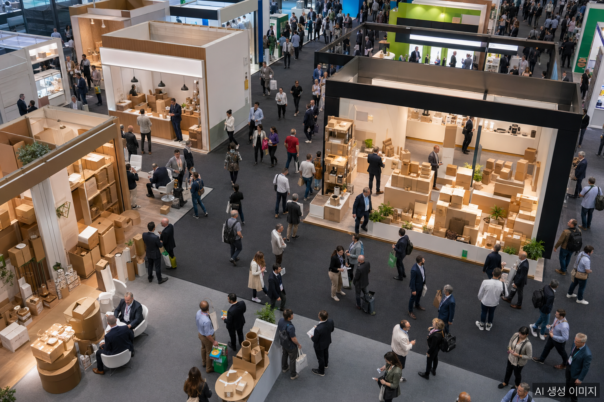
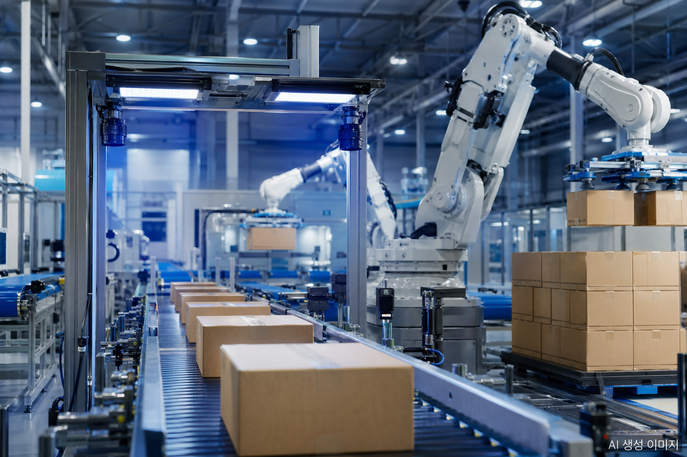

WEPACK 2026 wrapped up in late April at the Shenzhen World Exhibition & Convention Center, setting a new attendance record with more than 13,000 international visitors from over 130 countries. The result reaffirms that the center of gravity for global paper packaging — both demand and innovation — sits firmly in China.

## WEPACK 2026 by the Numbers

- **Total visitors**: **137,157** unique (158,659 visits)
- **International visitors**: 13,598 (19,682 visits)
- **Countries/regions represented**: 130+
- **Concurrent exhibitions**: 8 integrated shows
- **High-level forums**: 30+

The international attendance figure — over 13,000 — is unusually large for a China-based packaging show and signals WEPACK's transition from a domestic event into a true global trade fair.

## The Full Stack of Paper Packaging

WEPACK 2026 combined eight concurrent exhibitions into a single venue, covering the entire paper packaging value chain in one place:

| Domain | Coverage |
|--------|----------|
| Base materials | Corrugated base paper, kraft paper, eco-friendly pulp |
| Converting equipment | Corrugators, slitters, die-cutters |
| Printing technology | Digital, inkjet, offset |
| Finished products | Corrugated boxes, folding cartons, gift boxes, paper bags |
| Labels | Label printing, self-adhesive labels |
| Automation | AI vision inspection, robotic palletizing |
| Systems | MES, WMS, logistics automation |

## Trend 1 — Carbon Neutrality Goes Mainstream

The most visible shift this year was the launch of a dedicated **Carbon Neutrality Zone**. The Folding Carton show formally released the **China Packaging Carbon Footprint White Paper** — a guideline for Chinese manufacturers to measure and reduce packaging-related emissions.

This is best read as a downstream effect of EU PPWR (full enforcement August 12, 2026). Global brands are demanding carbon data and recyclability certification from their entire supply chain — and Chinese suppliers are responding visibly. Recyclable content, recycled fiber percentage, and carbon certification are now standard evaluation criteria.

## Trend 2 — Automation and AI Take the Floor

A new **High-Value Equipment & Automation Zone** drew strong interest. Key technologies on display:

- **AI vision inspection** — automated detection of print defects, corrugated cracks, and label misalignment
- **Robotic palletizing** — fully automated stacking enabling lights-out night operations
- **Integrated MES/WMS** — real-time production and inventory connectivity
- **Digital printing lines** — fast turnaround for high-mix, low-volume runs

Rising labor costs in China and Southeast Asia, combined with persistent labor shortages in Korea and Japan, are pushing the industry into a phase where **"automate or lose your margin"** has moved from slogan to reality.

## Trend 3 — What the Forums Discussed

Across more than 30 high-level sessions, the recurring themes:

- **Pulp and paperboard market outlook** — 2026–2027 supply and pricing
- **Sustainability certifications** — FSC, PEFC, and EU PPWR compliance
- **Digital transformation** — IT modernization across paper manufacturing
- **Label industry outlook** — digital labels, smart labels, RFID integration

## What Korean Companies Should Take Away

1. **EU PPWR is imminent** — eco-certification and carbon data tracking are no longer optional.
2. **Automation gap** — Korean small and mid-size paper/packaging manufacturers risk falling behind Chinese and Southeast Asian peers.
3. **Diversify export markets** — as Chinese packaging firms scale globally, Korea needs a clear differentiation strategy built on eco and high-value segments.
4. **Trade fairs still matter** — even in a digital-marketing era, in-person exhibitions remain the primary channel for discovering global B2B buyers.

WEPACK 2027 will return to Shenzhen. Korean paper packaging companies should consider participation seriously.

## FAQ

**Q: What was the most notable feature of WEPACK 2026?**

A record 137,157 visitors from 130+ countries, eight integrated concurrent shows with 30+ high-level forums, and a newly launched Carbon Neutrality Zone — together making this WEPACK the most internationally significant edition to date.

**Q: What trends should Korean companies focus on?**

Three: standardization of carbon neutrality certification, real adoption of AI vision inspection and robotic automation, and accelerated eco-conversion across global supply chains anticipating EU PPWR.

**Q: Is the schedule for WEPACK 2027 set?**

Yes — WEPACK 2027 will return to Shenzhen, China. Korean paper packaging companies should consider participation seriously to monitor competitive trends and meet international buyers.

## About the Author

**PackingMaster** — Editor of PaperPackLog. Covers market trends, product insights, and technology in the paper packaging industry.

**References**
- [PR Newswire, "WEPACK 2026 Concludes on a Record High" (April 27, 2026)](https://www.prnewswire.com/apac/news-releases/wepack-2026-concludes-on-a-record-high-reinforcing-chinas-role-at-the-heart-of-the-global-packaging-industry-302752990.html)
- [Pulp & Paper News, "Wepack 2026 concludes on record-breaking attendance" (April 27, 2026)](https://www.pulpapernews.com/20260427/17740/wepack-2026-concludes-record-breaking-attendance)
- [Stocktitan, "WEPACK 2026 Draws 137,157 Visitors From 130 Countries"](https://www.stocktitan.net/news/RELX/wepack-2026-concludes-on-a-record-high-reinforcing-china-s-role-at-lgwac7vxt23m.html)
- [WEPACK Official Site](https://www.wepack-expo.com/en-gb.html)
