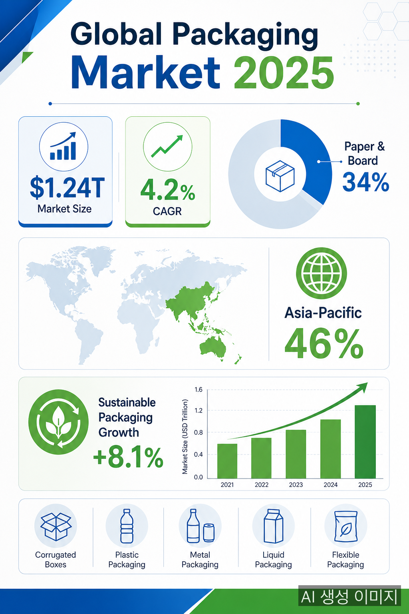
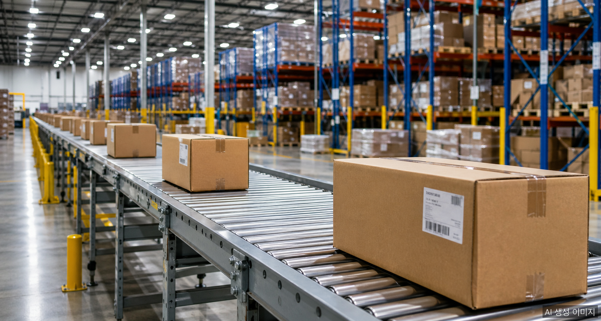

2025년 글로벌 포장 산업은 조용하지 않았다. 역대 최대 규모의 규제가 발효되었고, e커머스발 수요가 공급을 밀어붙였으며, 원가 압박은 어느 해보다 거셌다. 숫자로 먼저 보자.

## 시장 규모: 1.28조 달러

2025년 글로벌 포장 시장 규모는 **1조 2,800억 달러**로 집계됐다. 이 중 종이·판지 포장재 시장이 **4,173억 달러**를 차지했으며, 골판지 포장재만 따로 보면 **1,983억 달러** 수준이다. 아시아태평양이 4,305억 달러로 단일 권역 최대 시장을 유지했고, 북미가 그 뒤를 이었다.

성장률은 완만하다. 종이·판지 포장재는 연평균 4.63%로 2031년까지 5,475억 달러를 향해 움직이고 있다. 골판지는 연평균 3.78%로 2030년 2,388억 달러가 목표선이다. 폭발적 성장보다는 견조한 확장세다.

## 올해의 규제: EU PPWR 발효

2025년 포장 업계의 최대 이슈는 단연 **EU 포장재·포장폐기물 규정(PPWR, EU 2025/40)** 발효다. 2024년 12월 채택되어 2025년 2월 11일 공식 발효됐다. 본격 적용은 2026년 8월 12일이지만, 준비해야 할 항목이 만만치 않다.

핵심 내용은 세 가지다.

- **재활용 가능성**: 2030년까지 모든 포장재를 경제적으로 재활용 가능한 방식으로 전환
- **빈 공간 비율**: 2030년부터 집합·운송·e커머스 포장의 빈 공간을 최대 50%로 제한
- **재생 원료 의무**: 재활용 함량 추적, 재활용성 등급 부여, 컴플라이언스 보고 의무화

미국에서도 5개 주에서 생산자 책임 재활용(EPR) 법이 시행되며 규제 흐름은 대서양을 건넜다. 브랜드사들은 이미 종이 기반 포장으로의 전환을 서두르고 있다.

## e커머스: 수요의 엔진

e커머스 물동량 증가는 골판지 수요를 직접적으로 끌어올리고 있다. 골판지 박스는 식품·음료·의료·e커머스를 가리지 않고 범용성과 가격 경쟁력으로 시장을 지배 중이다. 2025년 골판지 시장에서 재생 섬유 비율은 **53.67%** 에 달했다.

다만 재생 섬유만으로는 품질 기준을 맞추기 어렵다. 섬유는 약 7회 반복 사용 후 기계적 성능이 저하되기 때문에, 컨버터들은 버진 장섬유를 **20~30% 혼합**하여 파열 강도와 내천공 성능을 보완하고 있다.

## 원가 압박: OCC·전기료의 이중고

2025년 1월 OCC(폐골판지) 가격은 전년 동기 대비 **톤당 7.10달러** 상승했다. 물류 병목과 아시아 제지사의 경쟁적 수요가 원인이었다. 유럽에서는 2024~25년 겨울 전력 현물 가격이 **MWh당 150유로**를 넘어서면서 골판지 생산 비용이 단기간에 숏톤당 28달러까지 뛰었다.

비용 상승을 흡수하지 못한 중소형 컨버터들의 통폐합이 이어졌고, 대형 제지·포장 그룹의 시장 점유율 집중이 가속됐다.

## 지속가능성: 소비자가 답을 정했다

소비자의 **81%** 가 지속 가능한 포장을 요구하고 있다. 바이오플라스틱 시장은 연평균 21.7%로 급성장 중이며 2025년 279억 달러를 넘어섰다. 디지털 인쇄의 도입도 빨라졌다. 소량 다품종 수요에 맞춘 잉크젯 기반 솔루션이 기존 오프셋 라인을 빠르게 대체하고 있다.

AI와 디지털화는 이제 생산 효율 이상의 의미를 가진다. 포장 설계 단계에서 재료 사용량을 최적화하고, 공급망 투명성을 확보하는 도구로 자리 잡고 있다.

## 2026년을 바라보며

PPWR 본격 적용(2026년 8월)을 앞두고 올해 유럽 브랜드사들의 포장 재설계 수요가 집중될 전망이다. e커머스 성장은 둔화되지 않을 것이고, 원가 부담도 당분간 이어질 가능성이 높다. 종이·판지 포장재의 수요 기반은 탄탄하지만, 수익성을 지키려면 기술 투자와 규모의 경제가 필수가 됐다.

2025년은 포장 산업이 '친환경'에서 '의무'로 전환점을 맞은 해로 기억될 것이다.

---

## 참고 자료

- [Global Packaging Market Set to Reach USD 1.75 Trillion by 2035 — GlobeNewswire](https://www.globenewswire.com/news-release/2026/04/24/3280892/0/en/Global-Packaging-Market-Set-to-Reach-USD-1-75-Trillion-by-2035-Driven-by-Sustainability-and-Smart-Innovation.html)
- [Paper and Paperboard Packaging Market — Mordor Intelligence](https://www.mordorintelligence.com/industry-reports/global-paper-and-paperboard-packaging-market)
- [Corrugated Board Packaging Market Size & Share — Mordor Intelligence](https://www.mordorintelligence.com/industry-reports/corrugated-board-packaging-market)
- [EU Packaging and Packaging Waste Regulation: New Compliance Requirements for E-Commerce — Greenberg Traurig](https://www.gtlaw.com/en/insights/2025/8/eu-packaging-and-packaging-waste-regulation-new-compliance-requirements-for-e-commerce)
- [EU PPWR – Packaging and Packaging Waste Regulation — business.gov.uk](https://www.business.gov.uk/campaign/europe/european-union-eu-regulations/eu-packaging-and-packaging-waste-regulation-eu-ppwr/)
- [Packaging Industry Statistics & Market Trends (2025) — Southern Packaging](https://www.southernpackaginglp.com/blog/packaging-industry-statistics)
