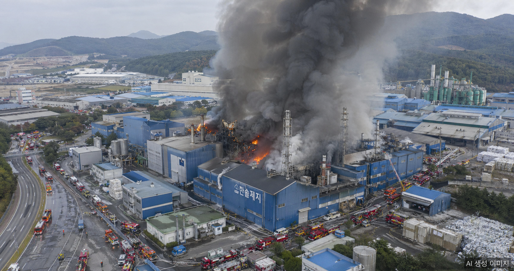
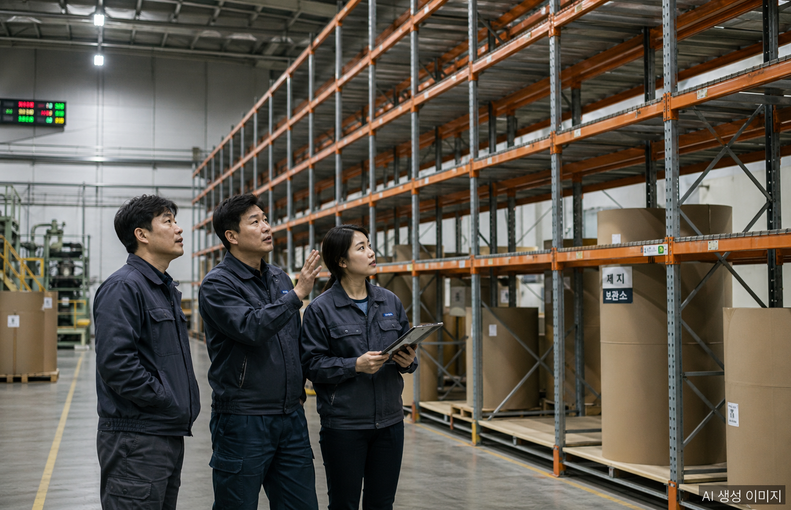

2026년 상반기, 국내 포장재 시장에 이례적인 공급 충격이 닥쳤다. 택배 박스와 식품 포장의 핵심 소재인 골판지 원지의 재고가 예년의 절반 수준으로 떨어졌고, 가격은 두 자릿수 상승세를 이어가고 있다. 그 배경에는 연달아 발생한 공장 화재와 인명사고가 있다.

## 두 공장의 가동 중단

### 한국수출포장공업 오산 공장 화재 (2026년 2월)

경기도 오산에 위치한 한국수출포장공업 공장에서 2월 화재가 발생했다. 이 공장은 국내 골판지 원지 공급량의 약 5%, 연간 25만 톤을 담당해온 거점이다. 당국은 정상화까지 수개월이 소요될 것으로 전망하고 있다.

### 아세아제지 세종공장 사망사고 (2026년 3월)

3월 24일 아세아제지 세종공장에서 노동자 추락 사망사고가 발생했다. 고용노동부는 즉시 작업중지 명령을 내렸고, 하루 약 1,800톤을 생산하는 공장 가동이 전면 중단됐다. 세종공장은 연산 62만 톤 규모의 아세아제지 최대 거점이다. 이후 4월 20일 고용노동부 승인을 받아 생산을 재개했으나, 한 달여의 공백이 시장에 미친 영향은 컸다.

## 재고 40% 감소, 가격 최대 18% 상승

한국제지연합회에 따르면 국내 골판지 원지 재고는 2026년 1월 기준 **15만 2,760톤**으로, 전년 동기 대비 **40% 감소**했다. 연합회는 2월 재고를 15만 톤, 3월을 12만 톤으로 추산했는데, 이는 예년 평균(약 24만 톤)의 절반 수준이다.

골판지 원지는 박스 제조원가의 **60%** 를 차지하는 핵심 원재료다. 이 원지 가격이 2025년 12월 이후 **12에서 18%** 상승했다. 여파는 부자재로도 번졌다. 접착제·인쇄용 잉크·포장용 랩 등의 가격은 **20에서 55%** 급등했다.

## 중동 리스크, 이중 충격의 배경

공급망 위기는 국내 사고에서만 촉발된 것이 아니다. 중동 긴장 고조로 호르무즈 해협 통제 가능성이 부각되면서 원자재 수급 불안이 겹쳤다. 이는 비닐·플라스틱 포장재의 원료인 나프타 수급 차질로도 이어져, 포장재 전반의 공급 불안이 확산되는 이중 충격 구도가 형성됐다.

## 업계의 반응: 상생 요청과 가격 인상 압력

한국골판지포장산업협동조합은 지난 4월 1일 골판지 상자 수요 기업에 상생 협력을 공식 요청했다.

> "골판지포장업계는 원지와 각종 원부자재 수급 불안 및 가격 상승이라는 이중고로 생산과 공급에 어려움을 겪고 있다."

조합은 국내 골판지 상자 제조기업 약 2,000개가 대부분 중소·영세업체로, 원가 상승을 자체적으로 감내하기엔 한계가 있다고 강조했다. 택배업체와 식품업체가 전체 골판지 생산량의 절반 이상을 소비하는 구조상, 가격 인상은 결국 소비자 가격에 순차적으로 반영될 것으로 전망된다.

## 연이은 안전 사고, 업계 전반의 과제

이번 위기는 단순한 공급 차질 이상의 의미를 갖는다. 2025년에도 한솔제지 신탄진공장에서 화재(9월)와 노동자 사망사고(7월)가 연달아 발생했고, 무림페이퍼도 잇따른 근로자 사망으로 경영 압박을 받고 있다. 제지 산업 전반의 안전 관리 체계를 재점검해야 한다는 목소리가 높아지고 있다.

## 전망

아세아제지 세종공장이 4월 20일 생산을 재개함에 따라 공급 상황은 점진적으로 개선될 것으로 보인다. 그러나 한국수출포장공업 오산 공장의 정상화에는 여전히 수개월이 필요하다. 재고가 예년 수준을 회복하기까지는 시간이 걸릴 것이며, 원지 및 부자재 가격의 상승 압력은 당분간 지속될 전망이다.

국내 물류·유통·식품 산업과 깊게 연결된 골판지 포장재 시장의 이번 위기는, 공급망 안전망의 취약성과 산업 안전의 중요성을 동시에 드러낸 사건으로 기록될 것이다.

## 자주 묻는 질문

**Q: 골판지 원지 재고가 40%나 감소한 이유는 무엇인가요?**

한국수출포장공업 오산공장 화재(2026년 2월)와 아세아제지 세종공장의 노동자 사망사고로 인한 작업중지(3월)로, 두 주요 생산 거점이 동시에 멈춘 것이 결정적 원인입니다. 두 공장만 합쳐 국내 원지 공급의 상당 비중을 차지합니다.

**Q: 가격 상승은 언제까지 이어질까요?**

아세아제지 세종공장은 4월 20일 재개됐지만, 한국수출포장 오산공장 정상화에는 수개월이 추가로 필요합니다. 2026년 상반기까지는 가격 상승 압력이 지속될 가능성이 높습니다.

**Q: 이번 위기가 일반 소비자에게도 영향을 미치나요?**

골판지 박스는 택배·식품 산업에서 사용 비중이 높아, 원가 상승분이 단계적으로 소비자 가격에 반영될 가능성이 큽니다. 특히 식품·생활용품의 포장 비용이 영향을 받습니다.

## 작성자 소개

**PackingMaster**: 페이퍼팩로그 편집자. 종이 포장재 산업의 시장 동향, 제품 정보, 기술 인사이트를 모아 정리합니다.

**참고 자료**
- [더퍼블릭, "중동 리스크에 화재·사고까지…골판지 공급망 '이중 충격'" (2026)](https://www.thepublic.kr/news/articleView.html?idxno=300000)
- [1코노미뉴스, "8개월 만에 '또' 사망 사고…아세아제지 중대재해 발생" (2026)](https://www.1conomynews.co.kr/news/articleView.html?idxno=47700)
- [네이트뉴스, "아세아제지 '작업중지' 세종공장, 한 달 만에 생산 재개" (2026.04.20)](https://news.nate.com/view/20260420n24479)
- [경기일보, "안성 골판지 제조업체서 화재, '대응 1단계' 발령⋯산불 확산 우려" (2025.11.23)](https://www.kyeonggi.com/article/20251123580070)
- [한국제지연합회 국내 제지산업 월별 수급현황](http://www.paper.or.kr/sub_5/5_1_2.php)
