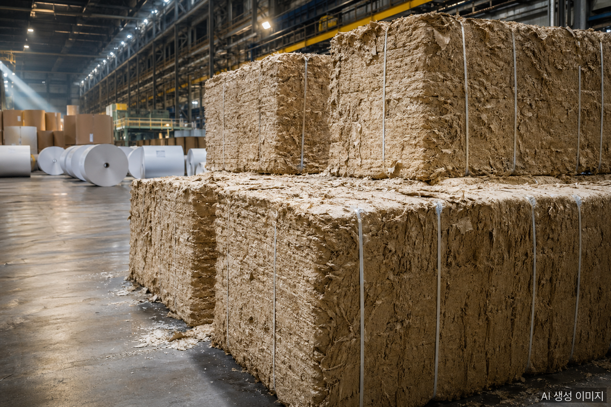

국내 제지업계가 2026년 들어 견디기 어려운 압박에 직면했다. 핵심 원재료인 펄프 가격은 다시 한 번 천장을 뚫고 있고, 환율과 해상운임은 동시에 뛰었다. 여기에 4월 발표된 인쇄용지 담합 과징금 3,383억원까지 더해지면서 업계는 단기간에 정상화가 어려운 4중고에 몰렸다.

## 펄프값, 1년 사이 20% 넘게 올랐다

국제 활엽수 표백화학펄프(BHKP / SBHK)는 4월 22일 기준 톤당 **780달러**를 기록했다. 한 달 전인 3월(760달러) 대비 **2.63%** 상승했고, 지난해 7월(640달러)과 비교하면 **20% 이상** 오른 수준이다. 침엽수 표백화학펄프(BSKP)도 비슷한 추세로 상승하고 있다.

펄프 가격 상승의 배경에는 글로벌 공급 측면의 보수적 운영, 중국·인도 등 신흥 시장의 수요 회복, 친환경 종이 패키징 수요 증가가 복합적으로 작용했다.

## 국내 제지사의 구조적 취약점: 수입 의존

문제는 국내 제지업계의 원료 조달 구조다. 무림P&P가 일부 펄프를 자체 조달하는 것을 제외하면, 한솔제지·한국제지·홍원제지 등 대부분의 제지사가 펄프 전량을 **수입**에 의존하고 있다. 국제 가격 상승이 시차 없이 원가 부담으로 전이되는 구조다.

특히 인쇄용지·산업용지 등 주력 품목의 원가에서 펄프가 차지하는 비중이 50% 이상이라, 톤당 100달러 변동만으로도 수익성에 즉각 영향을 미친다.

## 환율 1,500원대, 운임 30% 상승

원·달러 환율은 4월 들어 **1,500원** 안팎에서 고공행진하고 있다. 펄프 수입 결제가 모두 달러 기준이라 환율이 오르면 같은 양을 들여와도 원화 결제 부담이 그만큼 커진다.

해상운임도 상승했다. 상하이컨테이너운임지수(**SCFI**)는 중동발 리스크(이스라엘-이란 긴장 등) 이전 대비 **30% 이상** 올랐다. 펄프는 부피 대비 무게가 커서 해상 운송 의존도가 높다 보니 운임 상승이 곧 도착 원가 상승으로 직결된다.

## 4월 더해진 과징금 충격

업계 부담을 결정적으로 키운 것은 4월 23일 공정거래위원회의 발표였다. 한솔제지·무림P&P·한국제지·무림페이퍼·홍원제지·무림SP 등 6개사가 2021년 2월부터 2024년 12월까지 인쇄용지 가격을 담합한 혐의로 총 **3,383억원**의 과징금을 부과받았다.

펄프·환율·운임 인상으로 이미 수익성이 압박받는 상황에서 대규모 과징금까지 한꺼번에 발생한 셈이다. 일부 업체는 2026년 영업이익 적자 전환이 불가피하다는 관측이 나온다.

## 가격 전가의 한계

이론적으로는 원가 상승분을 판매가에 반영하면 되지만, 담합 과징금 직후 가격 인상을 단행하기는 부담스러운 상황이다. 공정위의 추가 감시 가능성, 인쇄·출판·식품 등 후방 산업의 가격 저항, 그리고 4월 시행된 가격 재결정 명령까지 고려하면 인상 폭과 시점 모두 제약을 받는다.

대안으로 검토되는 방향:
- **고부가 친환경 패키징 비중 확대** (플라스틱 대체 친환경 종이 포장재)
- **수출 비중 확대** (특히 친환경 인증을 갖춘 EU 시장)
- **에너지 효율화 + 자체 발전** (전력비 부담 완화)
- **장기 펄프 공급 계약** (현물 시세 변동 헤지)

## 단기 전망

국제 펄프 가격은 5~6월에도 상승세가 이어질 가능성이 높다는 분석이 많다. 환율도 미국 금리 정책과 중동 긴장 향방에 좌우되는 만큼 단기 안정은 어렵다. 결국 2026년 상반기 제지업계는 외부 변수의 동향을 견디면서 구조 조정과 사업 재편을 동시에 추진해야 하는 시기로 들어선다.

## 자주 묻는 질문

**Q: 펄프값이 오르면 왜 한국 제지업계가 더 큰 타격을 받나요?**

무림P&P를 제외한 대부분 국내 제지사가 펄프를 전량 수입에 의존하기 때문입니다. 국제 가격 상승이 시차 없이 원가에 반영되며, 자체 조달 여력이 거의 없습니다.

**Q: 펄프가 제지 원가에서 차지하는 비중은 어느 정도인가요?**

인쇄용지·산업용지의 경우 펄프가 원가의 50% 이상을 차지합니다. 톤당 100달러 변동만으로도 수익성에 즉각 영향을 줄 정도로 비중이 큽니다.

**Q: 환율이 펄프 가격에 어떻게 영향을 미치나요?**

펄프 수입 결제는 모두 달러 기준입니다. 원·달러 환율이 1,500원대로 오르면 같은 양을 들여와도 원화 결제 부담이 그만큼 커지고, 가격 인상분과 환율 인상분이 동시에 적용됩니다.

## 작성자 소개

**PackingMaster** — 페이퍼팩로그 편집자. 종이 포장재 산업의 시장 동향, 제품 정보, 기술 인사이트를 모아 정리합니다.

**참고 자료**
- [헤럴드경제, "물류비·펄프값·에너지費에 '담합 과징금'까지…제지사들 '우울한 2026'" (2026)](https://biz.heraldcorp.com/article/10724545)
- [헤럴드경제, "물류비·원자재값·과징금…제지업체, 올해 적자 불보듯" (2026)](https://biz.heraldcorp.com/article/10726232)
- [Trading Economics, 크래프트 펄프 가격 차트](https://ko.tradingeconomics.com/commodity/kraft-pulp)
- [한국수입협회 KOIMA 국제원자재가격정보](https://www.koimaindex.com/)
- [한국제지연합회 국내 제지산업 월별 수급현황](http://www.paper.or.kr/sub_5/5_1_2.php)
