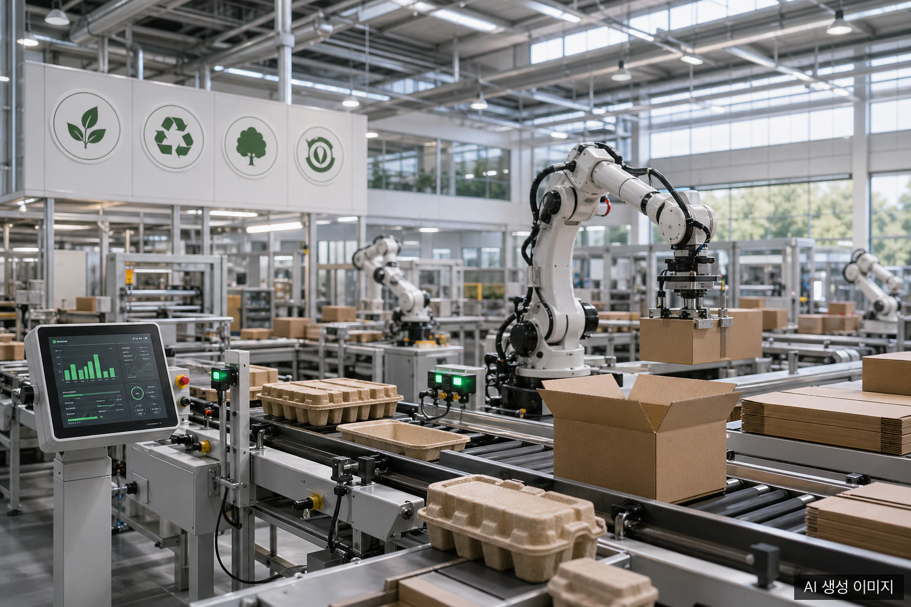
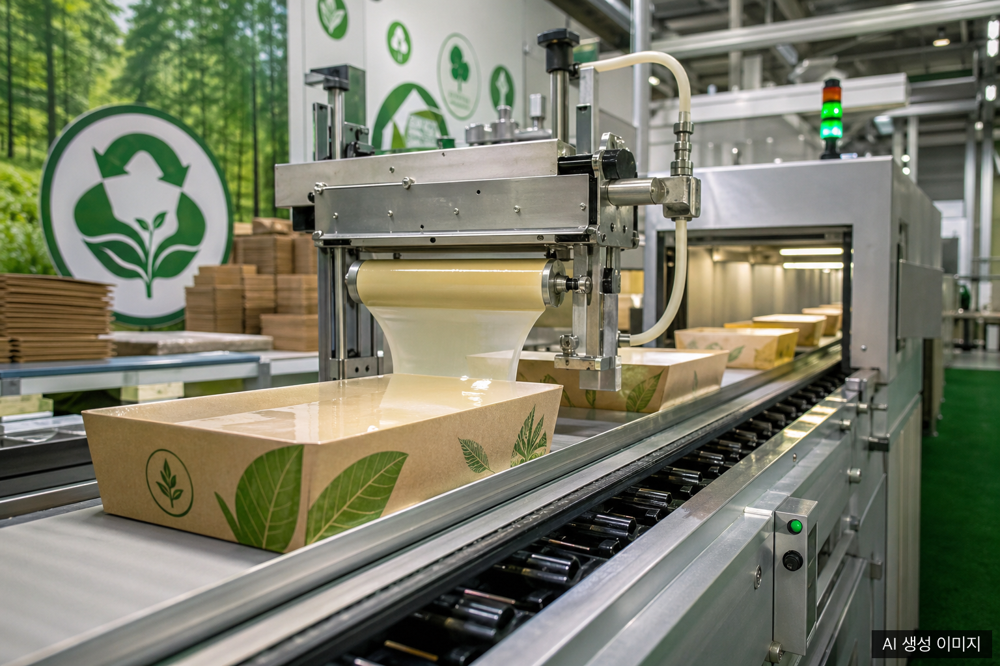
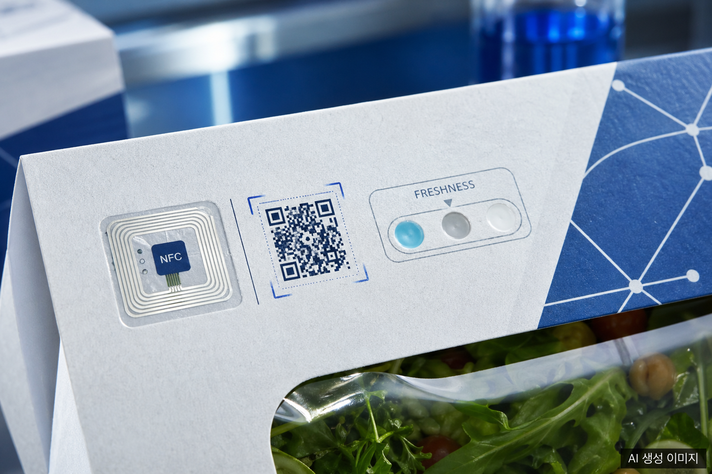

2026년 글로벌 종이 포장 산업은 하나의 단어로 요약하기 어렵다. 규제·기술·원자재·소비자 인식이 동시에 움직이며 전혀 다른 속도와 방향으로 시장을 밀고 당기기 때문이다. 이 글에서는 현장에서 실제로 의사결정을 바꾸고 있는 4대 키워드를 데이터와 함께 짚어본다.

## 시장 배경: 숫자가 말하는 2026

[Future Market Insights 보고서](https://www.futuremarketinsights.com/reports/paper-packaging-market)에 따르면 종이 포장 시장은 2025년 약 415억 달러에서 2035년 621억 달러로 CAGR 4.1%로 성장할 전망이다. 더 넓은 범주인 종이·판지 포장 시장은 2026년 3,520억 달러 규모에 달하며 같은 기간 CAGR 4.28%가 예측된다.

성장 동력은 명확하다. 플라스틱 규제 강화, e커머스 물량 증가, 그리고 이 글의 주제인 4대 키워드다.

## 키워드 1. 지속가능성: 재활용 72% vs. 플라스틱 14%

종이 포장의 가장 강력한 무기는 재활용률이다. 전 세계 판지 재활용률은 **72%**로, 플라스틱의 14에서 18%와 대비해 압도적이다. 이 수치 하나가 브랜드들이 플라스틱에서 종이로 전환하는 가장 직접적인 이유다.

### EU PPWR: 2026년 8월 12일부터 의무화

[EU 포장 및 포장 폐기물 규정(PPWR) 2025/40](https://environment.ec.europa.eu/topics/waste-and-recycling/packaging-waste/packaging-packaging-waste-regulation_en)은 2025년 2월 11일 발효되어 **2026년 8월 12일부터 전면 적용**된다. 핵심 요구사항은 두 가지다.

첫째, e커머스 소포를 포함한 모든 포장재의 빈 공간을 40% 이하로 제한한다. 둘째, 2027년부터는 QR 코드 등 **디지털 식별자**를 부착해 재질 구성, 재활용 가능성, 재사용 정보를 제공해야 한다. 생산자 책임 범위도 수거·선별·재활용·폐기 비용 전체로 확장된다.

[Gleiss Lutz 분석](https://www.gleisslutz.com/en/know-how/new-eu-packaging-regulation-key-requirements-august-2026)에 따르면 이 규정은 EU 내 유통 제품뿐 아니라 수출 기업에도 간접적으로 영향을 미친다.

### FSC 인증과 바이오 코팅의 가속

FSC(Forest Stewardship Council) 인증은 이제 글로벌 바이어의 기본 체크리스트에 들어갔다. [FSC 공식 사이트](https://fsc.org/en/businesses/paper-packaging) 기준 FSC 인증 종이 포장의 수요는 꾸준히 증가 중이다.

코팅 기술도 함께 진화하고 있다. 기존 플라스틱 코팅을 대체하는 **퇴비화 가능 종이 장벽 코팅** 시장은 2026년 7억 3,500만 달러에서 2035년 18억 3,500만 달러로 CAGR **10.7%** 성장이 예측된다. [GlobeNewswire 보고서](https://www.globenewswire.com/news-release/2026/02/04/3232100/0/en/Compostable-Paper-Barrier-Coating-Market-Trends-2026-35.html) 기준 바이오폴리머 코팅 세그먼트가 가장 빠른 성장세를 보인다.

<!-- IMAGE: 종이 포장 공장에서 FSC 인증 라벨이 부착된 친환경 포장재가 컨베이어에 흐르는 장면, 바이오 코팅 처리 과정, 밝은 공장 조명, 산업 사진 스타일 -->

## 키워드 2. 자동화: AI 눈, 로봇 손, 스마트 공장 두뇌

2026년 포장 자동화는 단순 반복 작업을 넘어 **판단하는 자동화**로 진입했다. 핵심은 AI 비전 시스템이다.

### AI 비전과 협동 로봇

AI 비전 시스템은 카메라와 머신러닝을 결합해 결함 감지, 라벨 검증, 제품 방향 확인을 실시간으로 처리한다. [Packaging World 분석](https://www.packworld.com/trends/digital-transformation/article/22949164/ais-impact-on-robotics-in-packaging-smart-automation-meets-realworld-productivity)에 따르면 AI 비전은 기존 자동화가 '너무 어렵다'고 여겼던 식품 분야에서 특히 빠르게 채택되고 있다.

협동 로봇(cobot)은 사람 옆에서 피킹, 팩아웃, 팔레타이징을 담당한다. 서보 구동 정밀 시스템, 자율 물류 AGV, Manufacturing Execution System(MES)과의 ERP 연동, 디지털 트윈이 한 공장 안에서 통합 운용된다.

[PMMI 2026 보고서](https://www.pmmi.org/news/ai-automation-and-sustainability-lead-packaging-and-processing-trends)는 AI 도입의 주요 효과로 예지 보전, 규제 대응, 데이터 가시화를 꼽는다. 생산 라인 최적화와 조기 불량 감지가 실질적인 비용 절감으로 이어진다는 것이다.

### WEPACK 2026: 자동화 트렌드의 집결지

2026년 4월 15일부터 17일까지 선전 세계전시컨벤션센터에서 개최된 [WEPACK 2026](https://www.wepack-expo.com/en-gb.html)은 역대 최다 관람객 137,157명(해외 13,598명 포함)을 기록했다. 골판지·폴딩 카톤 가공 장비, 디지털 인쇄, 자동화·물류 시스템이 8개 통합 전시로 구성되어 중국이 글로벌 포장 자동화의 허브임을 재확인했다.

유럽에서는 [PRINT DIGITAL CONVENTION 2026](https://www.drupa.com/en/Media_News/Press/Press_Material/Press_releases/PRINT_DIGITAL_CONVENTION_2026_Moving_into_the_future)이 2026년 6월 16일부터 17일까지 뒤셀도르프 메세에서 열린다. 인쇄와 디지털 채널의 결합, 포장과 마케팅의 융합이 핵심 의제다.

## 키워드 3. 스마트 소재: 패키지가 데이터가 된다

포장재가 단순 용기에서 데이터 노드로 진화하고 있다. 핵심 기술은 RFID/NFC, 신선도 지시기, QR 코드 디지털 ID다.

### RFID/NFC: 콜드 체인의 눈

[MIT J-WAFS 연구](https://jwafs.mit.edu/projects/2025/food-safe-wireless-rfid-sensor-smart-packaging-ph-monitoring-cold-chain)는 식품 안전 무선 RFID 센서를 스마트 포장에 통합해 콜드 체인 전반의 pH를 실시간 모니터링하는 기술을 개발했다. 에틸렌 센서와 RFID/NFC 모듈을 결합하면 포장이 '수동적 용기'에서 '능동적 데이터 노드'로 전환된다.

NFC와 QR 기반 추적을 결합한 유제품 물류 솔루션, 시간-온도 통합 지수와 유통기한 모델을 연동한 예측 IoT 플랫폼도 이미 상용화 단계다. [RSC Publishing 리뷰](https://pubs.rsc.org/en/content/articlehtml/2026/fb/d5fb00379b)는 에틸렌 감지 스마트 포장이 신선 농산물의 신선도 모니터링을 어떻게 바꾸는지 상세히 기술한다.

### 신선도 지시기: 색이 말해주는 부패 신호

신선도 지시기는 제품 부패 과정에서 발생하는 pH 변화에 반응하는 염료를 활용한다. [ScienceDirect 데이터 캐리어 리뷰](https://www.sciencedirect.com/science/article/pii/S2949822825001091)에 따르면 QR 코드는 패키지 자체에 특별한 하드웨어 없이 스마트폰 카메라만으로 읽을 수 있어 비용 효율이 가장 높다.

<!-- IMAGE: 스마트 포장 위에 부착된 NFC 태그와 QR 코드 클로즈업, 식품 신선도 지시기 색변화 패널, 첨단 기술 느낌의 블루톤 조명, 미래지향적 패키징 콘셉트 -->

### EU PPWR의 디지털 ID 의무화 (2027)

PPWR은 2027년부터 모든 포장에 디지털 식별자(QR 코드 등)를 부착해 재질 구성, 재활용 가능성, 재사용 정보를 구조화된 형태로 제공하도록 의무화한다. 스마트 소재와 규제가 수렴하는 지점이다.

## 키워드 4. 원자재 변동성: 예측 불가의 시대

2025년부터 2026년까지 원자재 시장은 '블랙스완' 이벤트가 반복되며 업계의 원가 예측 기반을 흔들었다.

### OCC 가격 급락: 41% 하락

[Packaging Dive 분석](https://www.packagingdive.com/news/occ-2025-price-supply-demand-box-markets-normal/737571/)에 따르면 구파지(OCC) 가격은 2024년 11월 톤당 74달러에서 2025년 11월 44달러로 **41% 급락**했다. 2025년 초 수출 수요로 반짝 10에서 15달러 반등했지만 이후 재하락했다.

[IndexBox 시장 분석](https://www.indexbox.io/blog/occ-and-mixed-paper-prices-plummet-over-40-in-2025-amid-market-volatility/)은 OCC 가격 변동성의 구조적 원인을 짚는다. 오늘의 OCC 공급은 3에서 5개월 전 골판지 박스 수요였다. 이 시차가 공급·수요 불균형을 증폭시킨다.

### 중국 폐지 수입 규제: 새로운 변수

[Packaging Dive 보도](https://www.packagingdive.com/news/occ-fiber-china-dry-pulp-restriction-regulation-price-volatility/803133/)에 따르면 중국은 2025년 10월 10일부터 재활용 펄프 수입 시 건식·습식 처리 방식을 명시하고 현장 검사를 의무화했다. 건식 가공 폐지 수입을 억제하려는 조치로, 업계는 이를 "블랙스완 이벤트"로 평가했다.

### 펄프·판지 가격 전망

미국 컨테이너보드 PPI는 2025년 1월 161.44에서 4월 163.30으로 소폭 상승했다. 미국 컨테이너보드 생산업체들은 2025년 1월 60에서 70달러/톤 인상을 단행했다. [Trading Economics 데이터](https://tradingeconomics.com/united-states/producer-price-index-by-commodity-for-pulp-paper-and-allied-products-paperboard-fed-data.html)는 2026년 이후 가동률 상승에 따른 완만한 인상을 예측하지만, 지정학적 변수가 새로운 변동성을 주입할 것으로 본다.

## 4대 키워드의 교차점

지속가능성·자동화·스마트 소재·원자재 변동성은 독립적으로 움직이지 않는다. 자동화는 원자재 낭비를 줄여 변동성 충격을 완충한다. 스마트 소재의 디지털 ID는 PPWR 규제 요건과 맞닿는다. FSC 인증과 바이오 코팅은 스마트 소재와 결합해 '지속가능한 스마트 포장'이라는 신범주를 만들고 있다.

2026년 이 4대 축이 어떻게 교차하느냐가 기업의 경쟁력을 가름한다.

---

## 자주 묻는 질문 (FAQ)

**Q. EU PPWR은 EU 내 기업에만 적용되나요?**

A. 그렇지 않습니다. EU 시장에 제품을 유통하는 모든 기업에 적용됩니다. 한국·중국·미국 등 수출 기업도 EU 유통 제품의 포장이 PPWR을 준수해야 합니다. 핵심 의무 적용일은 2026년 8월 12일이며, 디지털 식별자(QR 등) 부착 의무는 2027년부터 시작됩니다.

**Q. OCC 가격이 41% 하락했다면 포장 비용도 낮아지는 건가요?**

A. 단기적으로는 원가 부담이 낮아질 수 있습니다. 그러나 OCC 가격 하락이 컨테이너보드 생산업체의 수익 압박으로 이어지면 생산 조정이나 폐쇄로 이어질 수 있으며, 이는 다시 공급 부족과 가격 반등을 초래할 수 있습니다. OCC 가격의 3에서 5개월 시차 특성상 단기 하락이 중기 조달 비용에 미치는 영향을 면밀히 추적해야 합니다.

**Q. 스마트 포장(NFC/RFID)은 중소 기업도 도입할 수 있나요?**

A. QR 코드는 패키지에 특별한 전자 부품이 필요 없어 가장 저렴하게 스마트 포장을 시작할 수 있는 방법입니다. NFC/RFID는 초기 비용이 높지만 콜드 체인 유통을 다루는 식품·의약품 포장에서 장기 ROI가 검증되고 있습니다. EU PPWR의 2027년 디지털 ID 의무화는 QR 코드 도입 투자를 사실상 필수로 만들고 있습니다.

**Q. FSC 인증을 받으려면 어떻게 해야 하나요?**

A. [FSC 공식 홈페이지](https://fsc.org/en/businesses/paper-packaging)에서 인증 절차를 안내합니다. 원자재 조달부터 최종 제품까지 공급망 추적(Chain of Custody) 인증이 핵심이며, FSC 인증 심사기관을 통해 감사를 받아야 합니다.

**Q. 2026년 주요 종이 포장 산업 전시회는?**

A. WEPACK 2026(4월 15일-17일, 중국 선전), PRINT DIGITAL CONVENTION 2026(6월 16일-17일, 독일 뒤셀도르프)이 핵심 글로벌 행사입니다. 아시아 시장은 WEPACK, 유럽·디지털 인쇄 트렌드는 PDC에서 파악할 수 있습니다.

---

## 작성자 소개

**PackingMaster**: 페이퍼팩로그 편집자. 종이 포장재 산업의 시장 동향, 제품 정보, 기술 인사이트를 모아 정리합니다.

---

## 참고자료

- [Future Market Insights: Paper Packaging Market Outlook 2026-2036](https://www.futuremarketinsights.com/reports/paper-packaging-market)
- [GlobeNewswire: Compostable Paper Barrier Coating Market Trends 2026-35](https://www.globenewswire.com/news-release/2026/02/04/3232100/0/en/Compostable-Paper-Barrier-Coating-Market-Trends-2026-35.html)
- [Packaging Dive: Following market volatility, will OCC prices return to 'normal' in 2025?](https://www.packagingdive.com/news/occ-2025-price-supply-demand-box-markets-normal/737571/)
- [Packaging Dive: China's new pulp import restrictions create 'black swan event' for OCC](https://www.packagingdive.com/news/occ-fiber-china-dry-pulp-restriction-regulation-price-volatility/803133/)
- [IndexBox: 2025 Recycling Market Crash - OCC & Mixed Paper Prices Halved](https://www.indexbox.io/blog/occ-and-mixed-paper-prices-plummet-over-40-in-2025-amid-market-volatility/)
- [Gleiss Lutz: The new EU Packaging Regulation - Key requirements from August 2026](https://www.gleisslutz.com/en/know-how/new-eu-packaging-regulation-key-requirements-august-2026)
- [EU PPWR Official: Packaging and Packaging Waste Regulation](https://environment.ec.europa.eu/topics/waste-and-recycling/packaging-waste/packaging-packaging-waste-regulation_en)
- [FSC: Paper & Packaging](https://fsc.org/en/businesses/paper-packaging)
- [PMMI: AI, Automation, and Sustainability Lead Packaging Trends 2026](https://www.pmmi.org/news/ai-automation-and-sustainability-lead-packaging-and-processing-trends)
- [Packaging World: AI's Impact on Robotics in Packaging](https://www.packworld.com/trends/digital-transformation/article/22949164/ais-impact-on-robotics-in-packaging-smart-automation-meets-realworld-productivity)
- [WEPACK 2026 Official Site](https://www.wepack-expo.com/en-gb.html)
- [PRNewswire: WEPACK 2026 Concludes on a Record High](https://www.prnewswire.com/news-releases/wepack-2026-concludes-on-a-record-high-reinforcing-chinas-role-at-the-heart-of-the-global-packaging-industry-302752910.html)
- [drupa: PRINT DIGITAL CONVENTION 2026](https://www.drupa.com/en/Media_News/Press/Press_Material/Press_releases/PRINT_DIGITAL_CONVENTION_2026_Moving_into_the_future)
- [MIT J-WAFS: Food-safe wireless RFID sensor on smart packaging for pH monitoring](https://jwafs.mit.edu/projects/2025/food-safe-wireless-rfid-sensor-smart-packaging-ph-monitoring-cold-chain)
- [ScienceDirect: Data carriers for real-time tracking in smart packaging](https://www.sciencedirect.com/science/article/pii/S2949822825001091)
- [RSC Publishing: Smart packaging materials for ethylene detection and freshness monitoring](https://pubs.rsc.org/en/content/articlehtml/2026/fb/d5fb00379b)
- [Trading Economics: US PPI Paperboard](https://tradingeconomics.com/united-states/producer-price-index-by-commodity-for-pulp-paper-and-allied-products-paperboard-fed-data.html)
- [Towards Packaging: Paper and Paperboard Packaging Market Trends 2035](https://www.towardspackaging.com/insights/paper-and-paperboard-packaging-market-sizing)
