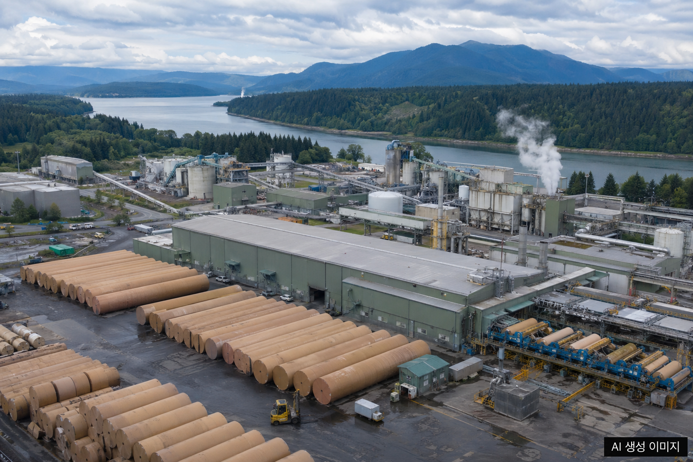
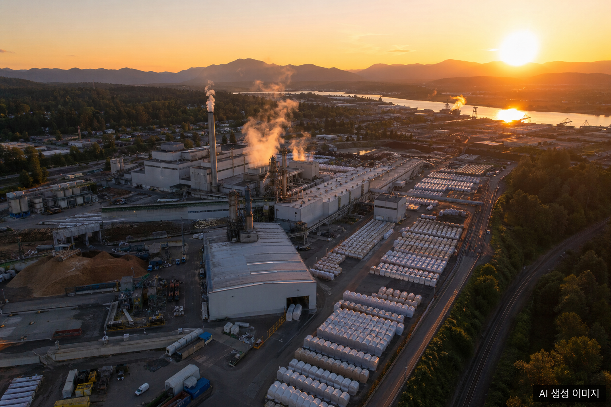

2026년 4월 16일, 세계 최대 제지·포장재 기업 중 하나인 **International Paper(IP)**가 미국 서부 해안의 골판지 제지사 **NORPAC(North Pacific Paper Company)**을 **약 3억 6,000만 달러(한화 약 3,600억 원)**에 인수한다고 공식 발표했다. 매각 주체는 사모펀드 **One Rock Capital Partners**다.

북미 컨테이너보드 시장에서 이미 지배적 위치를 점하고 있는 IP가 서부 해안 생산 거점을 추가함으로써, 북미 골판지·종이 포장재 시장의 지형이 한층 더 집중화될 전망이다.

## NORPAC이란?

**NORPAC(North Pacific Paper Company)**은 워싱턴주 **롱뷰(Longview)**에 위치한 종합 제지 기업으로, 3기의 생산 설비를 가동해 연간 약 **100만 단기톤(short ton)**의 컨테이너보드 및 관련 지종을 생산한다. 약 **500명**의 직원을 고용하고 있으며, 공장 역사는 약 50년에 달한다.

NORPAC은 1976년 일본의 **닛폰제지(Nippon Paper Industries)**와 미국의 **웨이어하우저(Weyerhaeuser)**의 합작법인으로 출범했다. 2016년 One Rock Capital Partners가 인수한 뒤 2021년부터 신문 용지 생산에서 **재활용 경량 골판지 포장지** 생산으로 전환을 추진해왔다. 이번 거래는 그 전환 과정이 성숙 단계에 도달했음을 보여주는 결과이기도 하다.

## 왜 지금, 왜 NORPAC인가

IP의 이번 인수는 CEO 앤디 실버네일(Andy Silvernail)이 추진 중인 전략적 전환(Transformation Strategy)의 연장선이다. 이미 IP는 유럽의 **DS Smith 인수**(완료)와 미시시피주 제지 시설 **2억 2,500만 달러 투자** 계획을 잇달아 발표했으며, NORPAC 인수로 북미 서부 해안이라는 지리적 공백을 메우게 됐다.

IP 패키징솔루션 북미 담당 EVP **톰 해믹(Tom Hamic)**은 인수 발표에서 이렇게 밝혔다.

> "NORPAC 인수는 전략적 적합성이 높다. 서부 해안 성장 시장에서 고객 서비스 역량을 강화하고 장기 가치 창출 우선순위를 지원한다."

이번 거래의 핵심 전략 포인트는 세 가지다.

1. **서부 해안 거점 확보**: 아마존·월마트 등 주요 이커머스 물류 허브가 밀집한 서부 해안 고객 기반을 IP의 기존 생산망에 통합
2. **재활용 경량 컨테이너보드**: NORPAC이 전환을 완료한 재활용 원료 기반 경량지가 친환경 포장재 수요 확대 트렌드에 부합
3. **운영 비용 절감**: IP가 워싱턴·오리건주에 이미 보유 중인 생산·재활용 시설과의 시너지로 물류·원가 최적화

거래는 규제 당국의 승인을 조건으로 **2026년 3분기** 내 완료될 예정이다.

## 북미 컨테이너보드 시장에서의 의미

이번 인수는 북미 컨테이너보드 시장이 구조적 변화를 겪고 있는 시점에 이뤄졌다. 2026년 1분기 북미 컨테이너보드 생산량은 최근 수년간 최대 폭의 감소를 기록했다는 업계 데이터가 있다. 수요 회복이 더딘 상황에서 생산 능력을 유지하기 위해서는 **규모의 경제와 원가 경쟁력**이 더욱 중요해졌다.

IP는 이번 NORPAC 인수를 통해 연간 생산 능력을 추가로 **100만 단기톤** 확보하게 됐다. 이로써 IP는 북미 컨테이너보드 시장에서의 지배력을 한층 강화하며, 중소 규모 경쟁사들에게 더 큰 원가·물류 압박을 가할 가능성이 높다.

## 한국 종이 포장재·골판지 업계 시사점

이번 거래가 국내 종이 포장재 업계에 직접적인 충격을 주는 것은 아니다. 그러나 몇 가지 중장기 흐름을 주목할 필요가 있다.

### 1. 글로벌 대형화 가속: 납품 단가 협상력에 영향

IP는 DS Smith(유럽) + NORPAC(북미 서부)을 연달아 인수하며 사실상 글로벌 통합 포장 솔루션 기업으로 전환하고 있다. 이 같은 메가 딜은 글로벌 원료·원지 공급 시장에서 대형 업체의 협상력을 높이고, 중소형 포장재 업체들의 원가 부담을 가중시키는 방향으로 작용할 수 있다.

국내 골판지 원지 수입 의존도를 감안하면, 북미 시장의 공급 집중화는 **원지 수입 단가와 공급 안정성**에 간접적 영향을 미칠 여지가 있다.

### 2. 재활용 경량 컨테이너보드 트렌드 주목

NORPAC의 전환이 시사하는 바는 분명하다. 북미·유럽 대형 발주처들이 **재활용 원료 기반, 경량화된 포장재**에 대한 요구를 점차 구체적인 조달 조건으로 명문화하고 있다는 점이다. EU PPWR 규제와도 맞닿아 있다.

국내 골판지·종이 포장재 업체들이 수출 경쟁력을 유지하려면 재활용 원료 비율 및 경량화 목표를 선제적으로 검토할 시점이다.

### 3. 닛폰제지 연결고리: 아시아 원지 시장과의 접점

NORPAC의 뿌리가 닛폰제지와의 합작법인이라는 사실은 흥미롭다. 북미 대형 제지사가 아시아 자본과 기술로 성장해 이제 IP에 흡수된다는 구조는, 북미-아시아 간 제지 산업 연결고리가 지속적으로 재편되고 있음을 보여준다. 국내 제지사 및 포장재 원지 수급 담당자들은 이 같은 인수합병 흐름을 꾸준히 모니터링할 필요가 있다.

## 자주 묻는 질문

**Q: International Paper의 NORPAC 인수 금액은 얼마인가요?**

약 **3억 6,000만 달러(한화 약 3,600억 원)**입니다. 매도자는 사모펀드 One Rock Capital Partners이며, 2026년 4월 16일 공식 발표됐습니다.

**Q: NORPAC의 생산 능력과 위치는 어디인가요?**

NORPAC은 미국 **워싱턴주 롱뷰(Longview)**에 위치하며, 3기의 설비로 연간 약 **100만 단기톤**의 컨테이너보드 및 관련 지종을 생산합니다. 약 500명의 직원이 근무하며, 1976년 닛폰제지-웨이어하우저 합작법인으로 출발한 50년 역사의 공장입니다.

**Q: 이번 인수가 한국 골판지·포장재 업계에 미치는 영향은 무엇인가요?**

직접적인 단기 영향은 제한적입니다. 그러나 북미 컨테이너보드 시장의 대형화 가속, 재활용 경량 포장재 수요 증가, 글로벌 공급망 집중화라는 세 가지 흐름은 국내 업체의 원지 수급 단가와 수출 포장 기준에 중장기적으로 영향을 미칠 수 있어 모니터링이 필요합니다.

## 작성자 소개

**PackingMaster**: 페이퍼팩로그 편집자. 종이 포장재 산업의 시장 동향, 제품 정보, 기술 인사이트를 모아 정리합니다.

**참고 자료**
- [PR Newswire, "International Paper to Acquire North Pacific Paper Company" (2026.04.16)](https://www.prnewswire.com/news-releases/international-paper-to-acquire-north-pacific-paper-company-302745070.html) <!-- pub: 2026-04-16 -->
- [Packaging Dive, "International Paper to acquire North Pacific Paper Co. for $360M" (2026.04.16)](https://www.packagingdive.com/news/international-paper-acquire-north-pacific-paper-containerboard/817755/) <!-- pub: 2026-04-16 -->
- [Packaging Insights, "International Paper to expand containerboard capacity with NORPAC acquisition" (2026.04)](https://www.packaginginsights.com/news/international-paper-norpac-acquisition.html) <!-- pub: 2026-04-15 -->
- [Recycling Today, "IP agrees to acquire Norpac" (2026.04)](https://www.recyclingtoday.com/news/international-norpac-paper-board-acquisition-recycling-2026/) <!-- pub: 2026-04-15 -->
- [EUWID Paper, "IP targets Norpac acquisition to bolster North American business" (2026.04.17)](https://www.euwid-paper.com/news/companies/ip-to-acquire-norpac-and-strengthen-170426/) <!-- pub: 2026-04-17 -->
- [Paper Age, "International Paper to Acquire North Pacific Paper Company for $360 Million" (2026.04.16)](https://www.paperage.com/2026news/04-16-2026international-paper-to-acquire-north-pacific-paper-company.html) <!-- pub: 2026-04-16 -->
