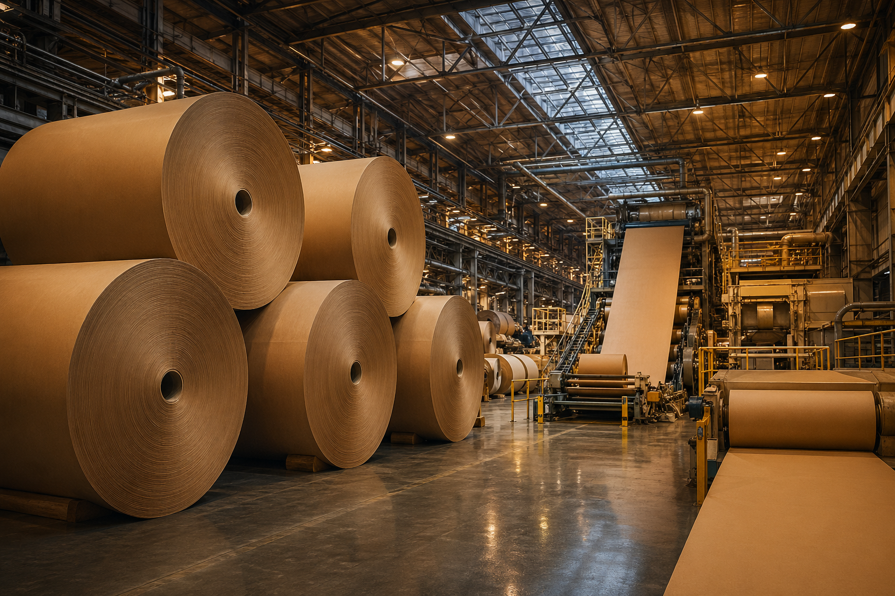
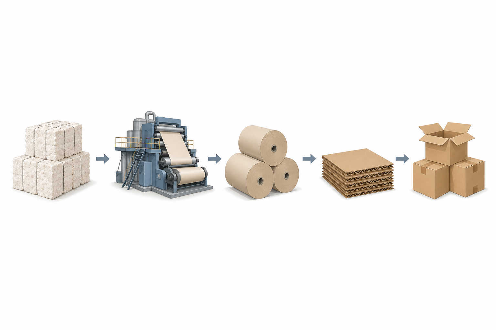
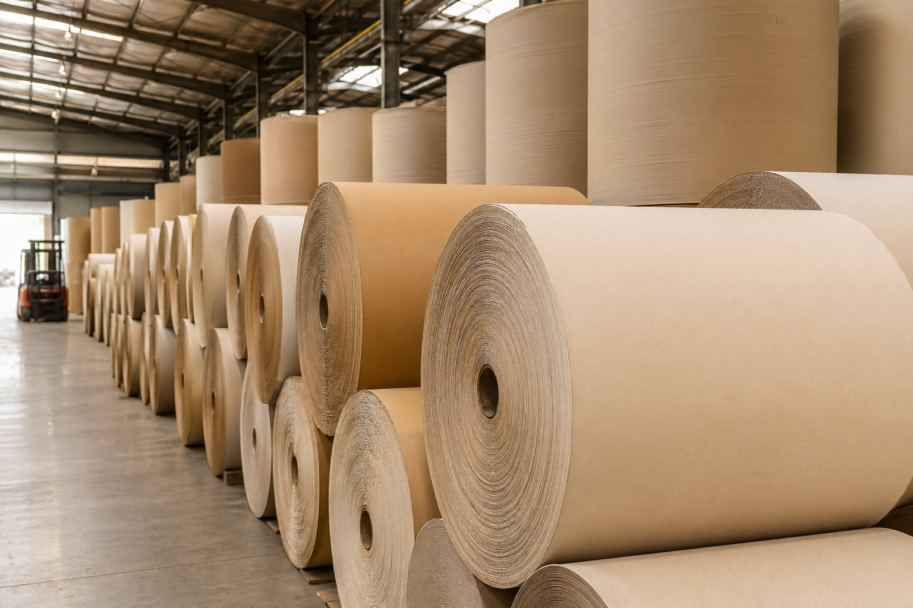

종이 포장재를 조달하다 보면 자연스럽게 궁금해진다. 이 원지는 어느 그룹 계열사가 만드는 것인지, 제지사인데 판지 사업도 함께 하는지. 단순히 "종이를 만드는 회사"로만 보면 시장 구조가 잘 보이지 않는다. 매출 기준 국내 상위 5대 제지 그룹의 사업 구조를 공급망 관점에서 정리했다.

## 국내 5대 제지 그룹 한눈에 보기

| 그룹 | 주력 분야 | 판지 |
|---|---|:---:|
| 한솔그룹 | 인쇄용지·특수지 | O |
| 무림그룹 | 인쇄용지 전문 | X |
| 아세아그룹 | 골판지원지·크라프트지 | O |
| 글로벌세아 | 골판지원지·골판지 상자 | O |
| 한국제지 등 | 인쇄용지·생활용지 | X |

## 1. 한솔그룹: 인쇄지에서 판지까지 겸비한 업계 1위

한솔제지는 국내 인쇄용지 시장 1위 기업이다. 1965년 삼성그룹에 인수된 새한제지공업이 전신이며, 1992년 삼성으로부터 독립한 뒤 2015년 한솔홀딩스 체제로 재편됐다.

**주력 제품군**: 인쇄용지, 감열지, 라벨지, 산업용 특수지
**연매출**: 약 2조원대 (2024년 기준)
**해외 수출 비중**: 전체 매출의 50% 이상

포장재 실무자 입장에서 한솔의 핵심 강점은 인쇄용지(한솔제지)와 포장 판지(한솔판지)를 그룹 안에서 함께 공급받을 수 있다는 점이다. 달러 강세 시기에 수혜폭이 크고, 2025년 1분기 매출은 5,755억원을 기록했다.

## 2. 무림그룹: 인쇄용지 전문, 수출 의존도 최고

무림그룹은 무림페이퍼, 무림P&P, 무림SP 세 법인이 역할을 나눠 인쇄용지 사업을 운영한다. 무림P&P가 펄프와 원지를 생산하고, 무림페이퍼가 최종 인쇄용지를 판매하는 구조다.

**주력 제품군**: 교육·출판·오피스용 인쇄용지
**대미 수출 비중**: 약 50%
**특이사항**: 골판지 계열사 없음, 인쇄용지 전문 그룹

환율 민감도가 업계 최고 수준이라 원화 약세 국면에서 실적 개선폭이 뚜렷하다. 2025년 1분기 매출은 3,190억원이며, 판지 사업 포트폴리오는 보유하지 않는다.

## 3. 아세아그룹: 1958년 창립, 골판지원지의 역사

아세아제지는 1958년 설립된 국내 최장수 제지사 중 하나다. 아세아(주)를 지주회사로 아세아시멘트, 한라시멘트와 같은 그룹에 속한다.

**주력 제품군**: 골판지원지, 크라프트지, 석고원지
**판지 연계**: 계열사 에이팩이 골판지 원단과 상자 생산 담당
**연매출**: 1조원 돌파 (2024년 기준)

아세아제지(원지 생산)에서 에이팩(원단 및 상자 가공)으로 이어지는 수직계열 구조가 특징이다. 원지 조달처와 판지 가공사가 같은 그룹이라 품질 안정성과 납기 대응 면에서 유리하다.

## 4. 글로벌세아그룹: 골판지 원지에서 박스까지 수직계열

태림페이퍼(원지)와 태림포장(골판지 상자)의 조합이 이 그룹의 핵심이다. 이커머스 물동량 증가로 골판지 수요가 급증하면서 가장 빠르게 성장한 제지계열 그룹이다.

**주력 제품군**: 골판지원지(라이너지, 골심지), 골판지 박스
**수직계열**: 태림페이퍼(원지) 공급에서 태림포장(박스 제조)까지 그룹 내 완결
**전략 인수**: 전주페이퍼 인수(약 4,949억원)로 원지 생산 기반 확대
**태림포장**: 전국 9개 공장 운영, 국내 포장업계 1위

원지 가격 변동과 수급 불안에 취약한 포장 시장에서 수직계열화는 강력한 경쟁 우위다. 2026년 현재 M&A 시장에서 기업가치 최대 2조원으로 거론되고 있다.

## 5. 한국제지 / 깨끗한나라: 각자의 전문 영역

**한국제지**는 교육·출판·상업인쇄 분야 인쇄용지 전문 기업이다. 2025년 1분기 연결 기준 매출 1,991억원을 기록했으며, 골판지 계열은 없다.

**깨끗한나라**는 화장지, 미용티슈 등 생활용지 분야의 대표 기업으로 B2C 포지션이 가장 명확하다. 2025년 1분기 매출 1,307억원.

두 기업 모두 판지 사업 포트폴리오는 보유하지 않는다.

## 제지와 판지를 동시에 운영하는 그룹 정리

| 그룹 | 제지 | 판지 |
|---|---|---|
| 한솔그룹 | 한솔제지 | 한솔판지 |
| 아세아그룹 | 아세아제지 | 에이팩 |
| 글로벌세아 | 태림페이퍼 | 태림포장 |

포장 원자재를 조달하거나 협력사를 선정할 때, 그룹 전체 포트폴리오를 파악해두면 원지에서 완제품 박스까지 단일 그룹으로 조달하는 것이 가능한지 빠르게 판단할 수 있다.

## 자주 묻는 질문

**Q: 제지사와 판지사는 어떻게 다른가요?**

제지사는 펄프를 원료로 인쇄용지, 특수지, 골판지원지 등 종이(원지)를 생산하는 기업이다. 판지사는 이 원지를 가공해 골판지 원단, 골판지 박스 등 포장재를 제조하는 기업이다. 일부 그룹은 두 사업을 동시에 영위한다.

**Q: 골판지원지를 공급하는 국내 주요 업체는 어디인가요?**

아세아제지와 태림페이퍼가 국내 골판지원지 시장의 양대 공급처다. 두 기업 모두 라이너지와 골심지를 생산하며, 시장 과점 구조를 형성하고 있다.

**Q: 수직계열화된 그룹에서 원지와 박스를 함께 조달하면 어떤 장점이 있나요?**

원지 가격 연동을 그룹 내에서 통제하는 구조이기 때문에 시장 수급 불안 시에도 납기와 품질이 상대적으로 안정적이다. 단일 창구로 소통할 수 있어 공급망 관리 비용도 줄어든다.

## 작성자 소개

**PackingMaster**: 페이퍼팩로그 편집자. 종이 포장재 산업의 시장 동향, 제품 정보, 기술 인사이트를 모아 정리한다. 현장과 데이터, 양쪽을 연결한 콘텐츠를 지향한다.

**참고 자료**
- [프린팅코리아, "2024년 한솔제지·무림페이퍼·한국제지 감사보고서 분석" (2025)](http://www.printingkorea.or.kr/bbs/board.php?bo_table=B12&wr_id=895)
- [조선일보, "제지 빅2 한솔·무림, 담합 철퇴에 깊이 사과" (2026.04.23)](https://www.chosun.com/economy/smb-venture/2026/04/23/34EHROZBQZFUDER2L7VRCXPGEA/)
- [딜사이트, "태림페이퍼, 한솔제지 아성 위협" (2025)](https://dealsite.co.kr/articles/115228)
- [뉴스1, "전주페이퍼 품은 태림, 골판지 시장 선두 굳힌다" (2023.12.26)](https://www.news1.kr/industry/sb-founded/5270004)
- [아세아홀딩스, 계열사 현황](https://www.asiaholdings.co.kr/company/relative?st=02)
