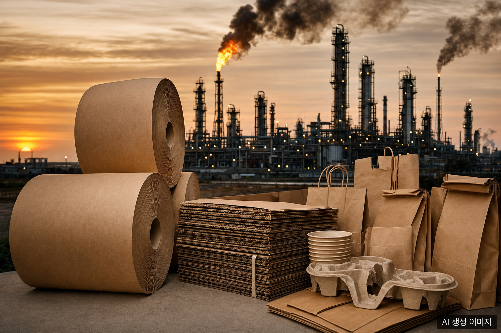
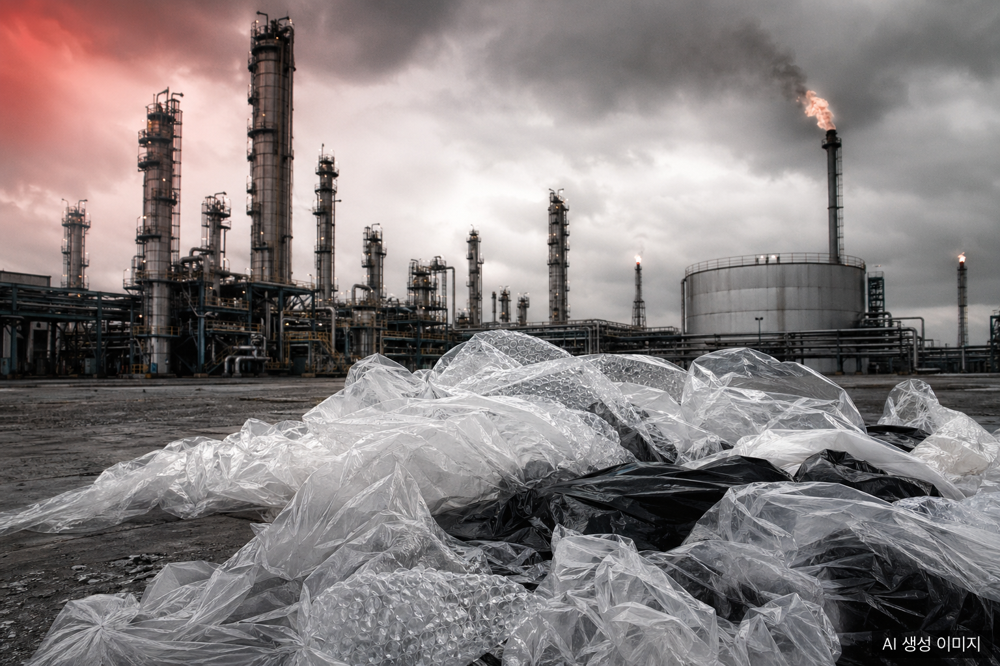
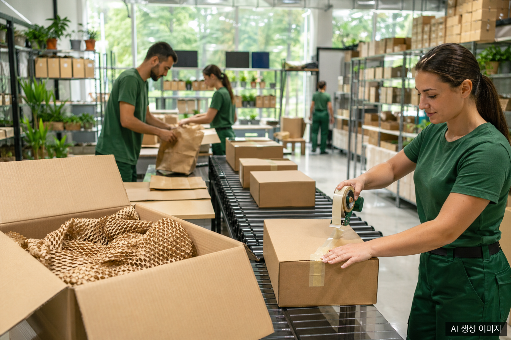

## 나프타 쇼크, 비닐 포장 산업을 흔들다

2026년 초 중동 전쟁이 장기화되면서 석유화학 산업의 핵심 원료인 나프타(Naphtha) 가격이 사상 유례없는 급등세를 기록했다. 2026년 1월 톤당 595달러 수준이던 국제 나프타 가격은 3월 말 1,141달러로 수직 상승하며 불과 두 달 만에 91.7% 폭등했다. 일부 구간에서는 톤당 1,220달러까지 치솟기도 했다.

폭등의 원인은 복합적이다. 중동 전쟁으로 인한 호르무즈 해협 봉쇄 위기로 한국이 수입하는 나프타의 절반 이상이 통과하는 핵심 물류 루트가 차단될 위험에 처했다. 여기에 글로벌 정유사들이 친환경 항공유(SAF) 의무 생산에 집중하면서 나프타 공급 자체가 구조적으로 줄어드는 이중 충격이 더해졌다.

나프타 가격 급등은 즉각 포장재 시장으로 전이됐다. 플라스틱 용기와 비닐의 핵심 원료가 나프타이기 때문이다. 소상공인협회에 따르면 포장재 가격은 평균 40% 이상 급등했으며, 배달 음식점에서 쓰는 일회용기 박스 가격은 일주일 만에 36,000원에서 48,000원으로 33% 뛰었다. 식품업계 일각에서는 "6월까지 포장재 재고를 확보했지만 이후는 모르겠다"는 우려 섞인 목소리도 나왔다.

<!-- IMAGE: 석유화학 공장 정제탑과 비닐 포장재 더미가 대비를 이루는 산업 사진, 경고성 뉘앙스, 어두운 배경에 붉은 톤 조명 -->

## 제지사, 기회를 보다: 한솔제지·무림페이퍼의 반격

나프타 대란은 제지사들에게는 역설적으로 기회의 창이 됐다. 비닐 포장재 원가가 치솟는 동안 종이 포장재는 상대적으로 원가 경쟁력이 살아났기 때문이다. 제지사들은 발 빠르게 종이 기반 대체재를 잇따라 출시하며 시장 선점에 나섰다.

### 한솔제지: 프로테고 HS 시리즈로 2차 포장재 시장 공략

한솔제지는 2026년 4월 기존 플라스틱 연포장을 대체할 수 있는 종이 기반 2차 포장재 '프로테고 HS(Heat Sealable)' 시리즈를 출시했다. 총 5개 제품군으로 구성된 이 시리즈는 초콜릿, 사탕, 분말소스, 김, 커피 등 다양한 식품의 2차 포장재로 활용할 수 있다.

프로테고 HS의 가장 큰 강점은 기존 설비를 그대로 사용할 수 있다는 점이다. 인쇄, 가공, 충전 등 주요 패키징 공정에 대한 사전 테스트를 완료해 고객사의 설비 변경 부담이 최소화된다. 또한 유럽연합(EU) 포장폐기물 규정(PPWR) 재활용성 최고 등급인 'A등급'에 부합하도록 설계돼 글로벌 수출 기업의 수요도 겨냥했다.

비용 측면에서도 메리트가 있다. 한솔제지는 종이 포장재가 생산자책임재활용제도(EPR) 분담금 면제 대상임을 전면에 내세우고 있다. 비닐·플라스틱 포장재에 부과되는 EPR 분담금이 사라지면 고객사 입장에서는 추가적인 운영비 절감 효과를 얻을 수 있다.

### 무림페이퍼: 아워홈과 손잡고 가정간편식 포장재 혁신

무림페이퍼는 대표 친환경 종이 소재 '네오포레 FLEX'의 적용 범위를 가정간편식(HMR) 포장재까지 확대하고 있다. 아워홈과 협업을 통해 개발한 이 종이 포장재는 기존 비닐 소재 포장재 대비 플라스틱 사용량을 40% 절감할 수 있다는 점에서 주목받고 있다.

무림페이퍼는 국내 대형 물류 기업과의 협업 경험도 풍부하다. 비닐 에어캡을 대체하는 종이 완충재를 공동 개발한 선례가 있으며, 2026년 나프타 대란을 계기로 유사한 협업 수요가 다시 늘고 있다.

## 유통 대전환: 탈(脫) 비닐 선언

제지사의 공급 확대와 맞물려 유통·물류 대기업들도 빠르게 움직이고 있다. 나프타 가격 급등에 따른 원가 부담에 더해 규제 리스크까지 더해진 상황이어서다.

쿠팡은 새벽배송 등에 사용되는 비닐 포장재를 종이봉투로 대체하는 방안을 추진 중이다. 쿠팡의 이 같은 움직임은 4월 30일 본격 시행된 자원재활용법 개정안에 선제적으로 대응하기 위한 전략이기도 하다. 개정법에 따르면 종이봉투로 전환하거나 종이 완충재를 사용할 경우 포장 공간 비율 기준을 기존 50%에서 70%로 완화해준다. 비용 절감과 규제 준수라는 두 마리 토끼를 동시에 잡을 수 있는 선택이다.

쿠팡의 결정이 공개되자 증시에서는 제지 관련 주가가 일제히 급등하는 등 시장도 빠르게 반응했다.

<!-- IMAGE: 물류 센터에서 종이봉투와 종이 완충재로 택배 박스를 포장하는 작업 장면, 밝고 친환경적인 분위기, 초록색 톤 -->

## 정책과 시장이 만나는 지점

이 흐름의 배경에는 규제 환경의 변화도 있다. 정부는 2026년부터 과대 포장 규제를 강화하면서 동시에 종이 포장재 사용에는 인센티브를 부여하는 방향으로 정책 방향을 잡았다. 종이 포장재 기업 입장에서는 수요 진작과 원가 경쟁력 확보라는 두 가지 호재가 동시에 작동하는 국면이 열린 셈이다.

글로벌 시장도 같은 방향을 가리킨다. 한국 종이 포장 시장 규모는 2024년 기준 약 82억 달러이며, 2032년까지 약 114억 달러로 성장할 것으로 전망된다(연평균 성장률 4.2%). 아시아 태평양 지역은 전 세계 종이 포장 시장의 38.43%를 점유하며 최대 시장으로 부상했다.

## 전망: 구조적 전환의 시작인가

나프타 가격이 언제 안정될지는 여전히 불투명하다. 중동 지정학 리스크가 해소되지 않는 한 가격 변동성은 이어질 가능성이 높다. 업계 전문가들은 이번 충격이 일시적 이벤트가 아닌 석유화학 기반 포장재 산업 전반의 구조적 전환을 앞당기는 계기가 될 수 있다고 분석한다.

제지사들은 이 기회를 통해 '환경 규제 대응'이라는 명분과 '원가 경쟁력'이라는 실익을 동시에 내세우며 포장재 시장에서의 입지를 넓히고 있다. 비닐과 종이의 경계가 무너지기 시작한 지금, 어떤 소재가 포장재 시장의 주도권을 쥘지 귀추가 주목된다.

## FAQ

**Q. 나프타 가격이 왜 갑자기 올랐나요?**

A. 2026년 중동 전쟁으로 호르무즈 해협 통과가 위험해지면서 한국 수입 나프타 공급망이 흔들렸습니다. 여기에 글로벌 정유사들이 친환경 항공유(SAF) 생산을 늘리면서 나프타 공급이 구조적으로 감소한 이중 충격이 더해졌습니다.

**Q. 종이 포장재가 비닐보다 실제로 저렴한가요?**

A. 가격 차이는 소재와 용도에 따라 다릅니다. 그러나 나프타 가격이 급등하면서 비닐 원가가 40% 이상 오른 반면, 종이 포장재는 EPR 분담금 면제 혜택까지 더해져 종합 비용 기준으로 상대적 경쟁력이 높아지고 있습니다.

**Q. 종이 포장재가 비닐을 완전히 대체할 수 있나요?**

A. 방습·방수가 중요한 냉동식품이나 액체류 포장은 아직 기술적 한계가 있습니다. 그러나 건식 식품 2차 포장, 완충재, 택배 봉투 등 상당수 응용처에서는 현재 기술로도 충분한 대체가 가능합니다.

**Q. 한솔제지 프로테고 HS는 어떤 제품인가요?**

A. 한솔제지가 2026년 4월 출시한 종이 기반 2차 포장재 시리즈입니다. 초콜릿·커피·김 등 건식 식품의 2차 포장에 사용할 수 있으며, 기존 플라스틱 포장 설비를 그대로 활용할 수 있어 도입 장벽이 낮습니다.

**Q. 쿠팡은 언제부터 종이봉투를 도입하나요?**

A. 쿠팡은 자원재활용법 개정안 시행(2026년 4월 30일)에 맞춰 단계적 도입을 추진 중입니다. 구체적인 전면 전환 시점은 아직 공식 발표되지 않았습니다.

## 작성자 소개

**PackingMaster**: 페이퍼팩로그 편집자. 종이 포장재 산업의 시장 동향, 제품 정보, 기술 인사이트를 모아 정리합니다.

## 참고자료

- [나프타, 전쟁 이후 2.3배 폭등...수급 차질 올 수도 (에너지경제, 2026-03-18)](https://m.ekn.kr/view.php?key=20260318022088801)
- [나프타 공포 왔다: 日 가격 2배, 공장 가동율↓ 제품가격 인상 (다음, 2026-04-29)](https://v.daum.net/v/20260429151505295)
- [나프타 대란에 포장재 값 폭등 (스포츠경향, 2026-03-31)](https://sports.khan.co.kr/article/202603310921003/)
- [소상공인協 "포장재 가격 40% 급등"...나프타 폭등에 재정 지원 촉구 (EBN, 2026)](https://www.ebn.co.kr/news/articleView.html?idxno=1703918)
- [한솔제지, 플라스틱 대체 종이 기반 2차 포장재 '프로테고 HS' 출시 (MTN뉴스, 2026-04-02)](https://news.mtn.co.kr/news-detail/2026040209195821912)
- [한솔제지, '나프타 대란' 속 종이 포장재 출시 (네이트뉴스, 2026-04-02)](https://news.nate.com/view/20260402n12713)
- ["플라스틱 40% 절감"...무림페이퍼, 아워홈과 가정간편식 친환경 종이 포장재 개발 (서울경제)](https://www.sedaily.com/NewsView/2H0J03023I)
- [나프타 불안·종이포장 인센티브...제지사 반사이익 (헤럴드경제, 2026-04-13)](https://heraldk.com/2026/04/13/%EB%82%98%ED%94%84%ED%83%80-%EB%B6%88%EC%95%88%C2%B7%EC%A2%85%EC%9D%B4%ED%8F%AC%EC%9E%A5-%EC%9D%B8%EC%84%BC%ED%8B%B0%EB%B8%8C%E2%80%A6%EC%A0%9C%EC%A7%80%EC%82%AC-%EB%B0%98%EC%82%AC%EC%9D%B4%EC%9D%B5/)
- [[단독] 탈 비닐 시동 건 쿠팡, 새벽배송에 종이봉투 쓴다 (서울경제, 2026-04-10)](https://www.sedaily.com/article/20031104)
- [제지株 급등...쿠팡 종이봉투 가능성에 제지사들 숨통 트일까 (헤럴드경제, 2026)](https://biz.heraldcorp.com/article/10715661)
- [CJ대한통운, 박스 포장에 친환경 종이 완충재 도입 (CJ뉴스룸)](https://cjnews.cj.net/cj%EB%8C%80%ED%95%9C%ED%86%B5%EC%9A%B4-%EB%B0%95%EC%8A%A4-%ED%8F%AC%EC%9E%A5%EC%97%90-%EC%B9%9C%ED%99%98%EA%B2%BD-%EC%A2%85%EC%9D%B4-%EC%99%84%EC%B6%A9%EC%9E%AC-%EB%8F%84%EC%9E%85/)
- [나프타 불안·종이포장 인센티브...제지사 반사이익 (헤럴드경제, 2026-04-13)](https://biz.heraldcorp.com/article/10716789)
- [한국 종이 포장 시장 규모 및 성장 전망 (Verified Market Research)](https://www.verifiedmarketresearch.com/product/south-korea-paper-packaging-market/)
