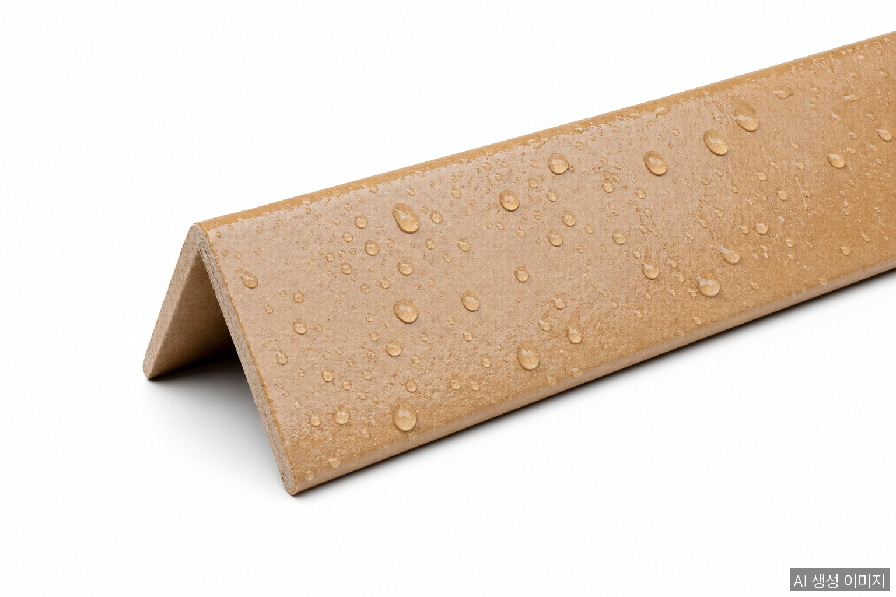

방수 종이앵글이란 표면에 방수·방습 코팅을 추가해 고습 환경에서도 강도와 형태를 유지하도록 만든 종이앵글이다. 일반 종이앵글이 V자 적층 구조로 압축 강도를 확보한다면, 방수형은 거기에 한 겹의 코팅을 더해 **물·습기·결로**라는 종이의 약점을 보완한다.

## 왜 방수 처리가 필요한가

종이앵글은 본질적으로 다층 크라프트지를 적층한 구조다. 강도는 뛰어나지만 종이 본연의 특성상 수분에 노출되면 다음 문제가 생긴다.

- **층간 박리**: 적층 접착제가 약해져 V자 단면이 풀어진다
- **압축 강도 저하**: 젖은 종이는 마른 상태 대비 압축 강도가 30에서 50% 떨어진다
- **곰팡이·세균 번식**: 식품·음료 포장에서 위생 문제로 직결
- **얼룩·외관 손상**: 고급 가전·가구 제품 외관 손상 우려

특히 다음 환경에서 일반 종이앵글은 한계가 명확하다.

| 환경 | 위험 요인 |
|------|----------|
| 냉장·냉동 창고 | 표면 결로(condensation) |
| 해상 수출 컨테이너 | 컨테이너 내부 습기, 항해 중 결로 |
| 식품·음료 팔레트 | 액체 누출, 세척수 |
| 농산물·꽃 물류 | 고습 환경, 직접 수분 접촉 |
| 동남아·중남미 수출 | 항만 보관 중 우기 노출 |

## 방수 코팅 3가지: 원리와 차이

### 1. 폴리에틸렌(PE) 코팅

가장 보편적이고 저렴한 방식이다. 종이 표면에 얇은 폴리에틸렌 필름을 라미네이팅해 수분 침투를 차단한다.

- **특징**: 낮은 비용, 우수한 방수성, 안정적인 공급
- **두께**: 약 10에서 30μm
- **단점**: 종이와 플라스틱이 결합돼 **재활용이 어렵다**. 별도 박리 공정이 필요하거나 폐기 처리

### 2. 왁스(Wax) 코팅

파라핀 왁스나 비즈왁스를 가열 도포해 종이 섬유 사이에 침투시키는 방식이다.

- **특징**: 코팅 중량 비율 10에서 25%, 두께 5에서 10μm
- **베리어 성능**: 비즈왁스 기준 수증기 베리어 약 **77% 개선**
- **장점**: 식품 등급 사용 가능, 비교적 친환경 (성분에 따라)
- **단점**: 고온에서 왁스가 녹을 수 있음, 일반 재활용 라인에서 제거 필요

### 3. 친환경 베리어 코팅 (신세대)

전통 PE·왁스의 환경 부담 때문에 최근 부상한 수성(water-based) 베리어 코팅이다.

- **대표 제품**: Cartaseal VWAF, EcoShield, TopScreen 등
- **특징**: 수성·플루오린 프리, 식물성 오일 기반(일부)
- **장점**: **재펄프화(repulpable) 가능 → 일반 재활용 가능**, MOSH/MOAH 등 유해물질 없음
- **단점**: 가격이 PE·왁스 대비 높음, 공급사가 한정적

## "완전 방수"란?: 초소수성과 학술 연구 동향

업계에서 "완전 방수"라는 표현이 자주 쓰이지만, 학술적·산업적으로 정량 기준이 따로 존재한다. 두 가지 측정 방법이 표준이다.

### 측정 1: 접촉각(Water Contact Angle, WCA)

물방울이 표면에 떨어졌을 때 형성하는 각도를 측정한다.

| 분류 | 접촉각 | 특성 |
|------|-------|------|
| 친수성 (Hydrophilic) | < 90° | 물이 빠르게 스며듦 |
| 소수성 (Hydrophobic) | 90°에서 150° | 물방울이 맺히고 천천히 스며듦 |
| **초소수성 (Superhydrophobic)** | **> 150°** | **물방울이 구르듯 흘러내림 (자가 세정)** |

일반 PE 코팅 종이앵글의 접촉각은 약 90에서 110° 범위로 "소수성" 영역에 속한다. **"완전 방수"라 부를 수 있는 초소수성은 150° 이상**이며, 이는 일반 코팅으로는 도달하기 어렵다.

### 측정 2: Cobb 테스트 (ISO 535)

고정 면적에 일정 시간(보통 60초) 물을 접촉시킨 후 흡수된 물의 양(g/m²)을 측정하는 표준법이다. 값이 낮을수록 방수성이 우수하다.

| 분류 | Cobb60 값 |
|------|-----------|
| 일반 종이 | 25에서 30 g/m² |
| 일반 방수(PE/왁스) 종이앵글 | 5에서 15 g/m² |
| 초소수성 코팅 종이 (학술 연구) | < 10 g/m² |

### 학술 연구 동향: 나노셀룰로오스 + 자가 복구

최근 학계에서는 나노셀룰로오스 기반 초소수성 코팅 연구가 활발하다.

- **Scientific Reports (2025)**: 나노셀룰로오스 + 4차 암모늄 실란 + PCC 코팅으로 접촉각 150° 이상, Cobb60 24.45 g/m² 달성. 항균성도 동시 확보
- **Nano-silica + 마이크로피브릴화 셀룰로오스** (PubMed, 2022): 고강도 + 초소수성을 동시 만족하는 다층 종이 개발
- **자가 복구 셀룰로오스 페이퍼** (ScienceDirect, 2025): 접촉각 156°, 손상 후 표면이 자가 복구돼 고습 환경 포장에 적용 가능
- **SF6 플라즈마 코팅** (PMC): 크라프트지에 플루오린 플라즈마를 처리해 코팅 첨가물 없이 소수성 부여
- **PVA + 나노셀룰로오스 + AKD 복합 코팅** (Scientific Reports): 물·기름·grease 동시 차단 (식품 포장 적용 가능)

### 학술 단계와 상업 단계의 격차

학술 연구는 접촉각 150° 이상을 안정적으로 달성하지만, 종이앵글 같은 산업 양산 제품에서 초소수성을 구현하기에는 다음 한계가 있다.

1. **단가**: 나노셀룰로오스·플라즈마 처리는 양산 단가 대비 5에서 10배 높음
2. **내구성**: 마찰·스트레칭에 코팅이 벗겨지면 효과 즉시 손실
3. **재활용성**: 일부 초소수성 코팅(불소화합물 기반)은 재펄프화 어려움
4. **인증**: 식품 직접 접촉용은 별도 안전성 인증 필요

따라서 현재 시장에서 통용되는 "완전 방수 종이앵글"은 사실상 **PE 또는 다층 베리어 코팅 + 충분한 두께**로 구현된 제품을 의미한다. 진정한 초소수성 종이앵글은 향후 5에서 10년 내 본격 상용화가 기대되는 영역이다.

### 어디까지가 충분한 방수인가

대부분의 산업 응용에는 **접촉각 110° + Cobb60 10g/m² 이하** 수준이면 충분하다. 다음과 같은 극한 환경에서만 초소수성이 필요하다.

- 직접 물 접촉이 빈번한 농산물·수산물 포장
- 항해 중 침수 위험이 있는 선창 화물
- 옥외 임시 보관이 잦은 건자재
- 다회 사용을 전제한 리유저블 포장

## 산업별 적용 가이드

**냉장·냉동 물류**
유제품·축산물·아이스크림 팔레트는 결로 발생률이 높아 방수 코팅이 거의 필수다. PE 코팅이 가장 보편적이지만, 식품 안전성을 강조하는 기업은 왁스나 친환경 코팅을 선호한다.

**해상 수출**
바다를 건너는 컨테이너는 출발지·도착지 온도차로 인한 결로가 심각하다. 동남아·인도·중남미행 화물에는 PE 또는 왁스 코팅 종이앵글이 표준이다.

**과일·꽃 등 농산물**
직접 수분 접촉이 잦고 위생 기준도 엄격하다. 친환경 베리어 코팅이 점차 표준으로 자리잡고 있다.

**대형 가전 수출**
TV·냉장고 박스 내부 코너 보강용으로 사용된다. 수출 컨테이너 내 결로로 인한 박스 손상을 방지하기 위해 방수형이 채택된다.

**철강·강판 코일**
고가 표면 마감 제품(아연도금, 스테인리스 등)은 작은 녹점 하나로 클레임이 발생한다. 코일 엣지 보호에 방수 앵글이 사용된다.

## 친환경 전환의 흐름

EU PPWR(2026년 8월 시행)과 국내 1회용 플라스틱 규제 강화로, 전통적 PE 코팅 종이앵글은 점진적으로 친환경 베리어 코팅으로 대체되는 추세다. 재펄프화 가능 코팅 제품의 단가가 아직 높지만, 다음 두 가지 흐름이 시장을 빠르게 움직이고 있다.

1. **글로벌 브랜드의 공급망 ESG 요구**: 식품·화장품 대기업이 자사 포장의 재활용성 등급을 의무화하면서, 1·2차 협력사도 같은 기준을 따르도록 요구
2. **EU PPWR 수출 통과 조건**: 비재활용 PE 코팅은 EU 수출 시 재활용성 등급에서 감점, 적합성 선언서(DoC) 작성에도 불리

## 선택 가이드

| 우선순위 | 추천 코팅 |
|---------|----------|
| 비용 최우선 | PE 코팅 |
| 식품 직접 접촉 가능성 | 왁스 또는 친환경 코팅 |
| EU 수출용 | 친환경 베리어 코팅 (재펄프화 가능) |
| 재활용성·ESG 강조 | 친환경 베리어 코팅 |
| 일회성 컨테이너 적재 | PE 코팅(가성비) |

## 자주 묻는 질문

**Q: 방수 종이앵글과 일반 종이앵글의 강도 차이는 어떤가요?**

마른 상태에서는 거의 같습니다. 차이는 습한 환경에서 나타납니다: 일반 앵글은 30에서 50% 강도가 떨어지지만, 방수형은 코팅 덕분에 마른 상태에 가까운 강도를 유지합니다.

**Q: PE 코팅 제품도 재활용이 되나요?**

전통 PE 코팅은 일반 종이 재활용 라인에서 분리가 어렵습니다. 별도 박리 공정이 있는 시설로만 가능하며, 보통은 폐기로 처리됩니다. 재활용을 원하면 친환경 수성 베리어 코팅 제품이 적합합니다.

**Q: 왁스 코팅은 식품 포장에 안전한가요?**

식품 등급 파라핀이나 천연 비즈왁스를 사용한 제품은 식품 직접 접촉도 안전합니다. 다만 제품 사양서에서 "Food Grade" 또는 "FDA Compliant" 표기를 반드시 확인해야 합니다.

## 작성자 소개

**PackingMaster**: 페이퍼팩로그 편집자. 종이 포장재 산업의 시장 동향, 제품 정보, 기술 인사이트를 모아 정리합니다.

**참고 자료**
- [(주)윤성, 종이앵글 제품 라인업](https://www.ysung.com/products?lang=ko)
- [Northrich, "Complete Guide to Paperboard Edge Protectors" (2025)](https://northrich.net/complete-guide-to-paperboard-edge-protectors-canada-usa-1204/)
- [ACS Environmental Au, "Wax Coatings for Paper Packaging Applications: Study of the Coating Effect on Surface, Mechanical, and Barrier Properties" (2024)](https://pubs.acs.org/doi/10.1021/acsenvironau.4c00055)
- [Greif, "Edge and Angle Board Product Guide"](https://www.greif.com/edge-and-angle-board/)
- [Solenis, "Eco-Friendly Barrier Coatings for Paper Packaging"](https://www.solenis.com/en/destination/sustainable-paper-packaging/)
- [Cortec Packaging, "EcoShield Barrier Coating for Paper and Corrugated"](https://www.cortecpackaging.com/product/ecoshield-barrier-coating-for-paper-and-corrugated/)
- [Scientific Reports (Nature), "Surface-coated paper packaging with nanocellulose modified with quaternary ammonium organosilane and precipitated calcium carbonate" (2025)](https://www.nature.com/articles/s41598-025-10306-5)
- [PubMed, "High-strength and super-hydrophobic multilayered paper based on nano-silica coating and micro-fibrillated cellulose" (2022)](https://pubmed.ncbi.nlm.nih.gov/35450633/)
- [ScienceDirect, "A superhydrophobic, self-healing, and recyclable cellulose paper based on a dynamically cross-linked interface" (2025)](https://www.sciencedirect.com/science/article/abs/pii/S2214993725003975)
- [PMC, "Effect of Water-Resistant Properties of Kraft Paper Using SF6 Plasma Coating"](https://pmc.ncbi.nlm.nih.gov/articles/PMC9506043/)
- [Measurlabs, "Cobb Water Absorption Test (ISO 535)"](https://measurlabs.com/products/paper-cardboard-water-absorptiveness-cobb/)
