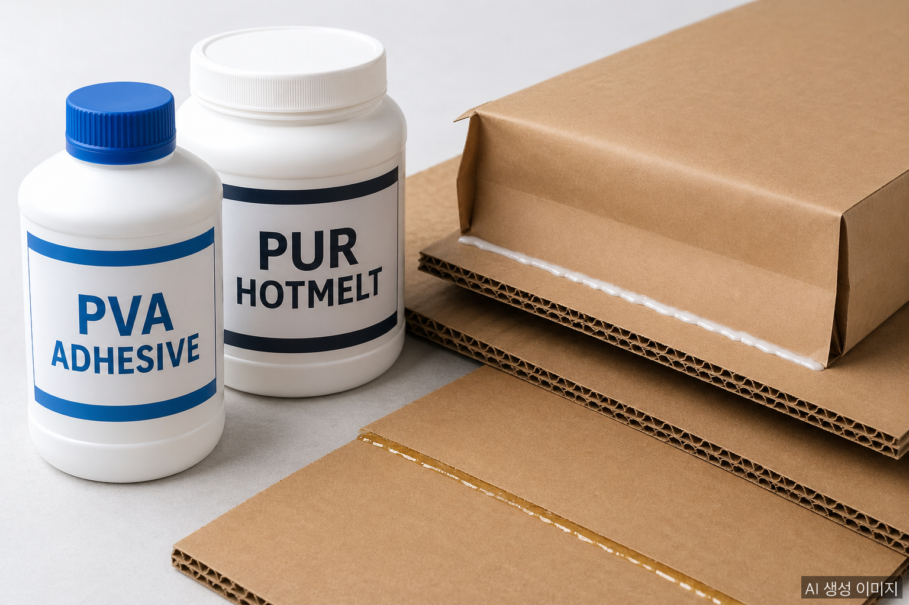
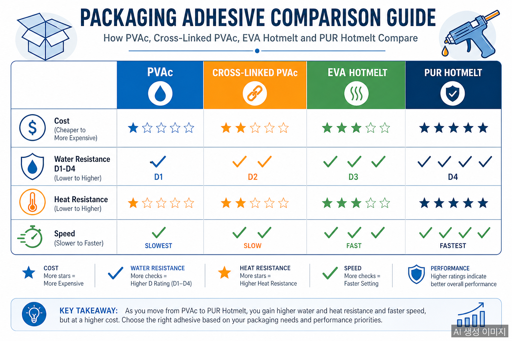
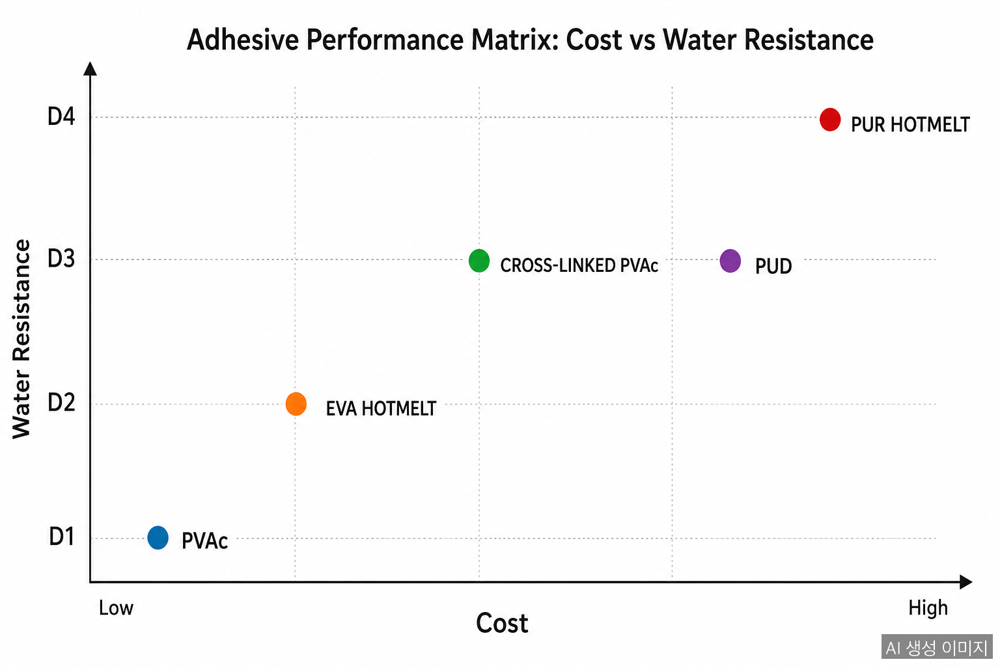

종이 포장재의 강도는 종이 자체보다 **접착제**로 결정되는 경우가 많다. V자 종이앵글의 적층, 골판지 라이너와 골심지의 접합, 평보드의 다층 합지: 모두 접착제가 끊어지면 종이가 멀쩡해도 제품은 무너진다. 한국 현장에서 가장 보편적으로 쓰이는 접착제는 **포리졸(PVAc 에멀젼)** 이지만, 방수가 필요한 환경에서는 다른 선택이 필요하다.

## 한국 표준: 포리졸 (PVAc 에멀젼)

포리졸은 폴리비닐 아세테이트(PVAc) 수분 분산형 접착제의 대표 브랜드명으로, 한국에서는 흰색 풀(목공용·종이용)의 일반 명칭처럼 통용된다.

**특징:**
- **저렴한 단가**: 종이 포장 산업의 표준 가격대
- **수분계 (water-based)**: VOC 거의 없음, 작업 환경 친화적
- **빠른 초기 점착**: 압착 후 단시간 내 고정
- **종이 친화성**: 셀룰로오스 섬유 사이로 침투해 강한 결합 형성
- **재활용성**: 종이와 함께 재펄프화 가능 (친환경)

**한계:**
- **방수 성능 부족**: 물에 노출되면 접착력 급격히 저하
- **고온 한계**: 60℃ 이상에서 연화
- **EN 204 등급**: 표준 D1에서 D2 수준 (실내·건조 환경)

종이앵글, 골판지 박스, 평보드 등 일반 환경 포장재에는 포리졸로 충분하다. 그러나 다음 환경에서는 한계가 명확하다.

| 환경 | 포리졸 한계 |
|------|------------|
| 냉장·냉동 결로 | 접착부 박리 발생 |
| 해상 컨테이너 | 항해 중 결로로 강도 저하 |
| 식품·음료 누출 | 액체 접촉 시 접착력 손실 |
| 옥외 보관 | 습기·우천 노출 시 즉시 열화 |

## 글로벌 표준: EN 204 등급

방수 접착제를 이야기할 때 빠지지 않는 기준이 **DIN EN 204**다. 유럽 목공·포장 산업에서 시작돼 전 세계 표준으로 자리잡은 내수성 분류 체계로, 종이 포장재 접착제에도 동일하게 적용된다.

| 등급 | 사용 환경 | 내수성 |
|------|----------|--------|
| **D1** | 실내, 건조 (≤ 50% RH 평균) | 가장 낮음: 일반 포리졸 |
| **D2** | 실내, 단기 고습 또는 단기 응축 | 약한 내수성 |
| **D3** | 실내, 잦은 단시간 물 접촉 또는 강한 고습 | 중간 내수성 |
| **D4** | 실외, 잦은 장시간 물 접촉 또는 직사 노출 | **완전 방수** |

방수 종이앵글이나 수출용 골판지 라미네이션에는 **최소 D3 이상, 가능하면 D4**가 권장된다.

## 방수 접착제 4가지 옵션

### 1. 가교형 PVAc (Cross-linked PVAc)

기본 PVAc에 가교제(예: AQUENCE Catalyst R.397, 이소시아네이트 계열)를 5% 비율로 추가하면 D3 PVAc를 D4 등급으로 업그레이드할 수 있다.

- **장점**: 기존 포리졸 라인 그대로 사용 가능, 비용 증가 적음
- **단점**: 가교제 작업 시간 제한(pot life), 사용 후 잔여물 폐기 처리
- **적용**: 방수 종이앵글, 방수 골판지 라미네이션
- **EN 204 등급**: D3 → D4 (가교제 추가 시)

### 2. PUR 핫멜트 (Reactive Polyurethane)

업계에서 가장 고급으로 평가받는 방수·내열 접착제. 수분과 반응해 경화하며, 일단 굳으면 다시 녹지 않는 가교 구조를 형성한다.

- **장점**: 최고 수준의 내수·내열·내약품성, 다양한 소재 본딩 가능 (종이·필름·금속)
- **단점**: 단가 높음 (PVAc 대비 3에서 5배), 전용 설비 필요
- **적용**: 고급 수출 포장, 식품 직접 접촉 라미네이션, 가구·자동차 부품 포장
- **특성**: 경화 후 D4 이상, 80약 100℃까지 안정

### 3. EVA 핫멜트 (Ethylene-Vinyl Acetate)

빠른 경화가 강점인 핫멜트. 자동화 라인에서 널리 쓰인다.

- **장점**: 매우 빠른 초기 점착, 자동화 적합, 저렴
- **단점**: 방수 성능은 PVAc와 비슷한 수준, 고온에서 재용융
- **적용**: 골판지 박스 봉함, 일반 라미네이션 (방수 요구도 낮은 경우)

### 4. 폴리우레탄 분산형 (PUD, Polyurethane Dispersion)

수분계 PU 접착제. 가교제와 결합하면 D4급 방수 + 식품 안전성 확보 가능.

- **장점**: 수분계라 작업성 좋음, 식품 직접 접촉 인증 가능 제품 존재
- **단점**: 가격 PVAc 대비 2에서 3배
- **적용**: 식품 포장, 의료용 포장, 친환경 인증 필요한 라미네이션

## 비교 요약

| 항목 | 포리졸(PVAc) | 가교 PVAc | EVA 핫멜트 | PUR 핫멜트 | PUD |
|------|-------------|----------|-----------|-----------|-----|
| 단가 | ★ (가장 저렴) | ★★ | ★★ | ★★★★ | ★★★ |
| 방수 (EN 204) | D1에서 D2 | D3에서 D4 | D2 | D4+ | D4 |
| 내열성 | 약 60℃ | 약 70℃ | 약 80℃ | 약 100℃ | 약 80℃ |
| 작업 속도 | 보통 | 보통 | 빠름 | 빠름 | 보통 |
| 자동화 | △ | △ | ◎ | ◎ | ○ |
| 재활용성 | ◎ | ○ | △ | △ | ○ |
| 식품 접촉 | 한정적 | 한정적 | 한정적 | 인증 제품 가능 | 인증 제품 가능 |

## 선택 가이드

- **일반 박스·앵글, 실내 보관** → 포리졸 (PVAc) 그대로 OK
- **냉장·해상 수출** → 가교 PVAc 또는 PUR 핫멜트
- **식품 직접 접촉** → PUD 또는 PUR 핫멜트(FDA 인증 제품)
- **자동화 라인 단일 적용** → EVA 핫멜트(일반) / PUR 핫멜트(방수)
- **EU PPWR 재활용성 등급 우선** → PVAc 또는 PUD (재펄프화 가능)

## 도입 시 주의사항

1. **기존 라인 호환성**: 새 접착제 도입 전 도포 장비·압착 시간 재설정 필요
2. **온도·습도 관리**: 핫멜트는 도포 온도 관리, 수분계는 보관 환경 관리 필수
3. **샘플 테스트 필수**: 같은 PUR이라도 종이 종류·평량에 따라 결합 강도 차이
4. **재활용성 인증**: EU 수출용은 접착제도 재펄프화 가능 여부 확인
5. **식품 안전 인증**: 직접 접촉 시 FDA, EU 1935/2004, KFDA 등 인증 확인

## 자주 묻는 질문

**Q: 포리졸을 그대로 쓰면서 방수 성능을 올릴 수 있나요?**

가능합니다. 가교제(이소시아네이트 계열, 약 5% 비율)를 첨가하면 D3 또는 D4 등급까지 끌어올릴 수 있습니다. 다만 가교제 첨가 후 작업 가능 시간(pot life)이 짧아져 라인 운영 방식 조정이 필요합니다.

**Q: PUR 핫멜트가 그렇게 좋은데 왜 모두 안 쓰나요?**

단가가 PVAc 대비 3에서 5배 비싸고, 전용 도포 장비(가열식 노즐, 밀폐 카트리지)가 필요해서 진입 비용이 높습니다. 또한 PUR은 수분에 반응해 경화하므로 보관·취급 조건이 까다롭습니다.

**Q: 식품 직접 접촉 포장에는 어떤 접착제를 써야 하나요?**

FDA(미국), EU 1935/2004(유럽), KFDA(한국) 인증을 받은 식품 등급 PVAc·PUR·PUD 제품을 사용해야 합니다. 인증 없는 일반 PVAc는 식품 직접 접촉이 금지됩니다.

## 작성자 소개

**PackingMaster**: 페이퍼팩로그 편집자. 종이 포장재 산업의 시장 동향, 제품 정보, 기술 인사이트를 모아 정리합니다.

**참고 자료**
- [Glue Guns Direct, "D2 / D3 / D4 PVAc Adhesives Explained"](https://www.gluegunsdirect.com/shop/pva-adhesives/d2-d3-d4-pvac-adhesives/)
- [Ureka, "What is the difference between D1, D2, D3 and D4 PVA and PU wood glues?"](https://thenamethatsticks.com/how-to-advice/what-is-the-difference-between-d1-d2-d3-and-d4-wood-adhesives/)
- [Kleiberit, "PVAc dispersion adhesives"](https://www.kleiberit.com/en/products/dispersion-adhesives/pvac-dispersion-adhesives)
- [Lux-X, "Waterproof PVAc adhesive for D4 wood bonding"](https://lux-x.com/en/novosti/vodostijkij-klej-pva-dlya-skleyuvannya-derevini-klasu-d4/)
- [PUR Hot Melt, "Water-based adhesives for paper & board converting applications"](https://www.purhotmelt.com/water-based-adhesives-for-paper-board-converting-applications/index.html)
- [Hotmelt.com, "Adhesives for Paperboard: Product Recommendations"](https://www.hotmelt.com/blogs/blog/adhesives-for-paperboard)
- [Chemix Guru, "PUR Adhesive vs EVA Hot Melt Adhesive"](https://www.chemixguru.com/eva-adhesive-pur-adhesive/)
- [Follmann, "Adhesive types"](https://www.follmann.com/en/products/adhesives/types)
