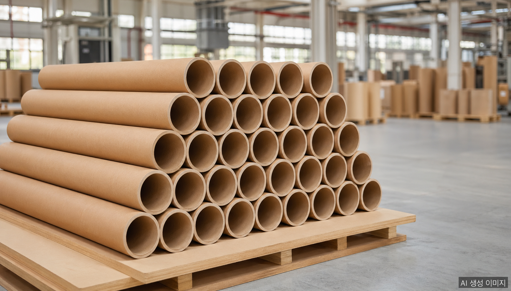
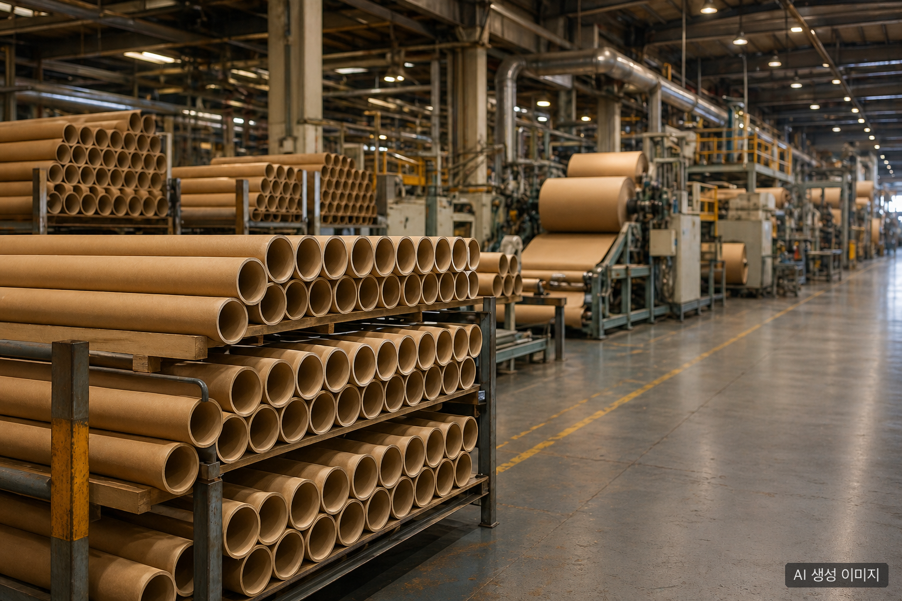

2026년 봄, 한국 지관(紙管, paper tube/core) 업계에서 들려오는 소식은 일관되게 무겁다. **"올해도 몇 곳이 문을 닫았다."** 업계 모임에 다녀온 관계자들이 공통적으로 전하는 이야기다. 그런데 정작 필름·섬유·종이원단 인쇄 등 지관을 사용하는 전방산업 쪽에서는 "공급이 끊겼다"는 비명이 거의 들리지 않는다. **폐업은 분명히 늘고 있는데 시장은 왜 멀쩡한가.** 이 글은 그 구조를 정리한다.

## 데이터로 본 2026 거시 환경

지관 업체의 어려움은 단독 사건이 아니다. 종이 포장재 산업 전체를 짓누르는 거시 환경이 있다.

| 항목 | 2026년 4월 현재 |
|---|---|
| 활엽수 표백화학펄프(SBHK) 가격 | 톤당 780달러 (전년 동기 대비 +20%) |
| 원·달러 환율 | 1,500원대 고공행진 |
| 상하이컨테이너운임지수(SCFI) | 중동 리스크 이전 대비 +30% 이상 |
| 브렌트유 / WTI | 100달러+ / 90달러대 후반 |

여기에 **2025년 12월부터 2026년 1월** 사이 태림페이퍼·전주페이퍼·한국수출포장·아진피앤피 등 주요 원지 제조업체가 골판지 원지 가격을 **10에서 25%** 일제히 인상했다. 접착제·인쇄용 잉크·포장용 랩 등 부자재 가격은 같은 기간 **20에서 55%** 추가 상승했다.

여기에 더해 2026년 4월 공정거래위원회는 한솔제지·무림P&P·한국제지·무림페이퍼·홍원제지·무림SP 등 **6개 제지사에 인쇄용지 가격 담합 혐의로 총 3,383억 원의 과징금**을 부과했다. 한국제지·홍원제지는 검찰 고발됐다. 제지 빅6 자체가 한솔제지 영업이익률 2% 미만, 무림P&P 영업손실 -245억 원 등 적자에 빠진 상태에서 거액의 과징금까지 더해진 셈이다.

원지 공급자가 흔들리니 후방의 가공업체는 더 흔들린다. **2026년 1월 한국박스산업협동조합 정기총회**에서는 "골판지·백판지 제조 대기업의 일방적 가격 인상 행위 규탄 결의문"이 채택됐다. 가공업계가 공식적으로 반발에 나선 것은 그만큼 후방의 체력이 한계에 가까워졌다는 신호다.

## 폐업의 3대 원인

업계 청취와 거시 데이터를 결합하면 지관 업체 폐업의 원인은 세 가지로 모인다.

### 1. 지속되는 수익성 악화

지관은 본래 박리다매 산업이다. 영업이익률이 한 자릿수 초반에 머무는 것이 일반적이고, 단가 협상력은 약하다. 그런데 펄프·전기료·물류비가 동시에 오르고 인건비도 누적적으로 상승했다. 단순 1, 2년의 일시적 적자가 아니라 **5년 이상 누적된 수익성 침식**이 한계 사업장의 결단을 앞당겼다.

### 2. 최근 원지값 인상

2025년 말부터 본격화된 원지 가격 인상은 결정타가 됐다. **원지가 12에서 25% 오르고 부자재가 20에서 55% 오르는데 지관 단가는 그만큼 못 올린다.** 전방의 거래처(필름·섬유·인쇄·제지롤 가공)도 자체 단가 인상 여력이 빠듯하기 때문이다. 결국 인상분의 상당 부분을 가공업체가 흡수해야 하고, 흡수할 체력이 없는 업체가 먼저 정리된다.

### 3. 후계자 부재

가장 구조적이고 가장 무거운 원인이다. 한국 영세 제조업의 1세대 창업주들은 1960년대에서 1970년대생이 다수다. 60대 후반에서 70대에 들어선 이들이 은퇴를 고민할 시점에 후계자가 없다. 자녀는 제조업을 기피하고, 외부 영입은 비용·문화 양면에서 어렵다. **수익성 악화 + 후계자 공백**이 겹치면 매각도 어려운 영세사업장은 자연스럽게 폐업으로 향한다.

이것은 지관만의 문제가 아니라 한국 제조업 전반의 가업승계 절벽과 맞닿아 있다. 그러나 박리다매 + 노동집약 + 가족경영이 결합된 지관 업계에서 그 충격이 먼저, 더 강하게 나타난다.

## 그런데 왜 전방산업은 멀쩡한가

폐업이 잇따르는데 필름 공장·섬유 공장·인쇄 공장에서 "지관이 안 들어와서 라인이 멈췄다"는 비명이 들리지 않는 이유는 단순하다. **사라진 물량이 살아남은 업체로 흡수되고 있기 때문**이다.

규모 있는 업체들의 공통점은 다음과 같다.

- 자동화·표준화된 생산 라인으로 단위 원가 우위
- 다품목 동시 생산으로 가동률 안정 (지관 외 평보드·종이앵글·종이파렛 등 다각화)
- 펄프·원지 대량 구매로 단가 협상력 확보
- 2, 3세 경영 체제 정착으로 의사결정 연속성

영세 사업장이 정리되면서 발생한 수요 공백은 이들 규모 업체의 가동률 상승으로 흡수된다. 단기적으로는 전방산업의 공급 안정이 유지되고, 장기적으로는 시장이 더 집중화된다.

## 진짜 변화: 거래처가 잃고 있는 것

겉으로는 멀쩡해 보이지만 B2B 구매팀 입장에서는 조용히 사라지고 있는 것이 있다.

1. **공급처 다변화 옵션이 줄어든다.** 견적 비교를 받을 업체 수 자체가 줄어든다. "10년 전엔 5곳 받던 견적을 이제 2곳에서만 받는다"는 구매 담당자가 늘고 있다.
2. **가격 협상력이 약해진다.** 살아남은 업체는 굳이 무리하게 단가를 깎을 이유가 없다. 영세 업체와의 단가 경쟁이 사라지면서 가격은 자연스럽게 상향 안정된다.
3. **납기·품질 리스크가 집중된다.** 공급처가 줄면 공급처 한 곳의 화재·노조파업·설비사고가 자사의 라인스톱으로 직결된다.

즉 **공급은 안정되지만 협상력과 분산 리스크는 악화**되는 구조다. 표면적인 "공급 안정"만 보고 안심해서는 안 된다.

## 살아남는 공급처의 4가지 조건

이 시점에서 B2B 구매팀이 공급처를 평가할 때 확인해야 할 4가지 조건이다.

### ① 사업 다각화

지관 단일 품목으로만 가는 업체보다 **종이앵글보드·평보드·받침목·종이파렛·지관 등 다수 종이 포장재를 함께 생산하는 업체**가 외부 충격에 강하다. 한 품목의 수요가 빠져도 다른 품목이 받쳐주기 때문에 가동률 변동이 작다.

### ② 규모와 자동화

연 매출 일정 규모 이상에 자동화 라인을 갖춘 업체는 단위 원가에서 영세 사업장을 압도한다. 원지값이 올라도 흡수 여력이 있고, 단가 협상에서도 합리적 라인을 잡는다.

### ③ 후계 체제

대표 한 명에게 의존하는 가족경영은 매력적인 안정성처럼 보이지만 후계 공백 시 사업장 자체가 사라진다. **2, 3세 경영 체제가 명확히 자리 잡았거나 전문경영 시스템이 갖춰진 업체**가 5년에서 10년 단위 구매계약의 신뢰성이 높다.

### ④ 재무 체력

영업이익이 마른 업체는 원지값 인상 한 번에 휘청거린다. 공시 자료가 없는 비상장 중소기업이라면 **납품 거래 이력·신용평가 등급·납세 실적**으로 우회 검증할 수 있다.

이 네 가지를 모두 충족하는 공급처는 점점 줄고 있다. 그래서 **장기 공급계약을 묶어두는 협상력 자체가 구매팀의 새로운 성과지표**가 된다.

## FAQ

**Q. 지관이 부족해질 가능성은 있나?**
단기적으로는 거의 없다. 사라지는 사업장의 물량을 규모 있는 업체가 흡수하고 있어서 시장 전체 공급량은 안정적이다. 다만 지역 편중(영남·호남에 폐업이 집중된 경우 등)이나 특정 규격(고하중·대구경 지관 등)에서는 조달 리드타임이 늘 수 있다.

**Q. 지관 가격은 어디까지 오를까?**
2026년 내내 추가 상승 압력이 유지된다. 펄프 가격이 톤당 780달러대를 유지하고 환율이 1,500원대에 머물면 원지값 인상이 한 번 더 진행될 수 있다. 다만 전방산업의 가격 전가 한계가 있어 폭이 무한히 커지지는 않는다. 합리적 시나리오는 **연 5에서 12% 추가 상승** 수준이다.

**Q. 어떤 공급처를 골라야 하나?**
사업 다각화·규모·후계 체제·재무 체력의 4가지 조건을 충족하는 업체가 안전하다. 견적이 가장 싼 곳을 단순 선택하기보다, 5년 후에도 같은 가격으로 같은 품질을 댈 수 있는 곳인지 보는 관점이 필요하다.

**Q. 지관조합이나 협회 차원의 대응은 있나?**
한국박스산업협동조합은 2026년 정기총회에서 골판지·백판지 대기업의 가격 인상 행위 규탄 결의문을 채택했다. 산업 전체 차원의 가격 협상·공동 대응 움직임이 본격화되고 있다. 다만 지관 단독 협회 차원의 공식 데이터 발표는 아직 제한적이다.

**Q. 다품목 종이 포장재 종합 제조사의 시장 위치는?**
지관, 종이앵글보드, 평보드, 받침목, 종이파렛 등 다품목을 동시에 생산하는 종합 제조사는 산업 재편 국면에서 흡수자(consolidator) 위치에 선다. 단일 품목 영세 사업장이 정리되면서 발생하는 수요 공백을 안정적으로 받아내는 역할이다.

## 작성자 소개

**PackingMaster**: 페이퍼팩로그 편집자. 종이 포장재 산업의 시장 동향, 제품 정보, 기술 인사이트를 모아 정리합니다.

## 참고자료

- [물류비·펄프값·에너지費에 '담합 과징금'까지…제지사들 '우울한 2026' (헤럴드경제)](https://biz.heraldcorp.com/article/10724545) <!-- pub: 2026-04-24 -->
- [물류비·원자재값·과징금…제지업체, 올해 적자 불보듯 (헤럴드경제)](https://biz.heraldcorp.com/article/10726232) <!-- pub: 2026-04-27 -->
- [박스업계 "골판지 및 백판지 제조 대기업 가격인상 행위 규탄 결의문 채택" (헤럴드경제)](https://biz.heraldcorp.com/article/10685856) <!-- pub: 2026-03-03 -->
- [박스업계 "골판지 및 백판지 제조 대기업 가격인상 행위 규탄" (매일일보)](https://www.m-i.kr/news/articleView.html?idxno=1342150) <!-- pub: 2026-03-03 -->
- [중동 리스크에 화재·사고까지…골판지 공급망 '이중 충격' (더퍼블릭)](https://www.thepublic.kr/news/articleView.html?idxno=300000) <!-- pub: 2026-04-06 -->
- ['공중전화 쓰고, 동전 던지고'…공정위, 제지 담합에 3천억 과징금 (다음뉴스)](https://v.daum.net/v/20260424064815299)
- [제지업계, 글로벌 경기 둔화 속 실적 악화...올해는 더 어렵다 (뉴스핌)](https://www.newspim.com/news/view/20260410000924)
- [비싸진 펄프·골판지…종이값 줄인상 우려 (한국경제)](https://www.hankyung.com/article/2026021199021)
- [연초부터 치솟는 펄프…종이컵·택배박스 '도미노' 가격인상 가능성 (헤럴드경제)](https://biz.heraldcorp.com/article/10682848) <!-- pub: 2026-02-26 -->
- [골판지업계, '원지-원단-박스' 도미노 가격 인상 (딜사이트)](https://dealsite.co.kr/articles/160014) <!-- pub: 2026-04-14 -->
